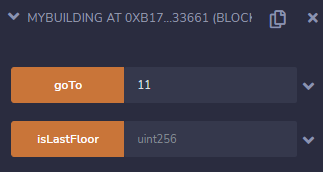
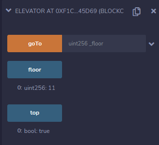

# 👋 Elevator
__Difficulty 4/10__

- 승리 조건
- 코드 분석
- 풀이
순서로 진행 될 것이다.

- - -

## 승리 조건
- elevator가 top에 갈수 있게 만드는 것이다.
- 즉 top 변수를 true로 만들면 된다.

- - -

## 코드 분석
분석은 주석에!

```solidity

// Building contract interface
interface Building {
    function isLastFloor(uint) external returns (bool);
}

contract Elevator {
    bool public top;
    uint public floor;

    // 선택 층으로 올라가는 function
    function goTo(uint _floor) public {
        // Building contract에 msg.sender(contract address) 대입
        Building building = Building(msg.sender);

        // 만약 isLastFloor가 false라면 floor와 top 재설정
        if (! building.isLastFloor(_floor)) { 
        floor = _floor;
        top = building.isLastFloor(floor);
        }
    }
}

```
- - -

이번 문제는 굉장히 이해하기 어려웠다. 아무리 봐도 문제 자체를 이해할 수 가 없어서 [12번 Privacy](https://holyhansss.github.io/ethernaut/12_privacy_ethernaut/12_privacy_ethernaut/)를 먼저 풀었다ㅋㅋ

### 풀이를 위한 Setup
[RemixIDE](https://remix.ethereum.org)를 사용한다. 
remix 사용법은 YouTube와 google에 많이 나와있으니 최신것으로 찾아보자!
그리고 docs를 읽어본다면 사용법을 쉽게 익힐 수 있을 것이다.

한 가지 주의할 점은 Instance는 remix에서 바로 deploy하는 것이 아니라 ethernaut에서 만든 instance의 주소를 가지고 addressAt을 누르면 된다.
또한 우리는 Rinkeby Network를 사용하고 있으니 ENVIRONMENT를 "Injected Web3"를 선택해주어야 한다.

## 풀이
이 문제에서 우리의 elevator가 top에 갈수 있게 만드는 것이다. 근데 goTo()를 보면 알 수 있다싶이 top이 false일 수 밖에 없게 만들어 두었다. if문이 false일 때만 들어올 수 있기 때문에

하지만 여기서 주목해야할 점은 interface의 isListFloor이 view 또는 pure가 아니라는 것이다. 즉 우리가 state를 설정해 바꿀 수 있다는 것이다.

그렇다면 어떻게 바꿀 수 있을까?   
```solidity
    Building building = Building(msg.sender);
```
위 코드를 보면 알 수 있다시피 msg.sender가 contract여야 한다. 

그렇다면 한번 MyBuilding contract를 보며 깊이 이해해보자!
```solidity
contract MyBuilding {
    Elevator elevator;
    bool lastFloor;

    constructor(address _elevator) public {
        elevator = Elevator(_elevator);
        lastFloor = true;
    }

    // interface에서 가져온 function
    function isLastFloor(uint) external returns (bool){
        // lastFloor이 true 면 false로 false면 true로 바꾼다.
        lastFloor = !lastFloor;
        return lastFloor;
    }

    // elevator의 goTo()를 call한다.
    function goTo(uint _floor) public {
        elevator.goTo(_floor);
    }
}
```
Elevator contract의 goTo() if문에서는 build.isLastFloor()이 false여야한다. 하지만 그렇게 되면 top도 false가 될 수 밖에 없기 때문에 isLastFloor()이 불릴때마다 return 값을 바꿔주면 된다. 생각보다 의외로 간단했다. 즉 처음에 if문에서 false를 return하면 top부분에서는 true를 return하게된다.

그럼 remix에서 MyBuilding contract를 배포하고 goTo()를 실행시키면된다. 나는 11층을 goTo의 parameter로 지정했다.


그렇게되면 아래와 같이 floor의 값이 11로 바뀌고 top도 true로 바뀐다.


이후 Submit instance를 누르고 조금 기다리면 block이 mine되고, 아래와 같이 뜨며 마무리된다.
```
٩(- ̮̮̃-̃)۶ Well done, You have completed this level!!!
```

- - -

## 마무리
다 풀고 생각해보니 내가 interface에 대한 이해가 부족하다는 생각이 든다. ethernaut 덕분에 나의 부족한 점을 하나하나 채워나갈 수 있는 것 같다ㅎㅎ. 지금 생각해보면 openzppline의 ERC token들의 interface들도 잘 이해하지 못했던 것 같다. 한번 ERC token들의 interface도 읽어보며 좀 더 완벽한 이해를 해보자! 또한 view와 pure에 대한 중요성에 대해 깨닫을 수 있던 문제였던것 같다. 이제 거의 절반을 끝냈다. 화이팅 @~@

- - -
## 기타 정보
- rinkeyb network ether faucet: https://faucets.chain.link/rinkeby
- ethernaut: https://ethernaut.openzeppelin.com/
- remix IDE: https://remix.ethereum.org

```