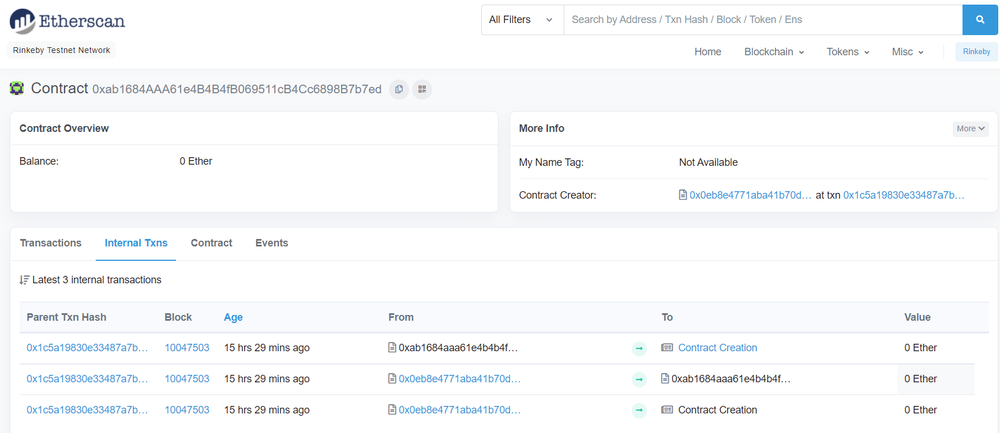
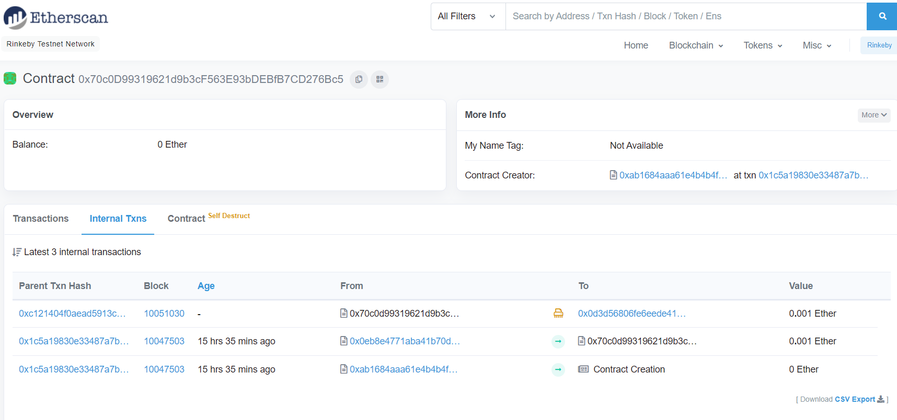

# 👋 1. Recovery
__Difficulty 6/10__

- 승리 조건
- 코드 분석
- 풀이
순서로 진행 될 것이다.

- - -

## 승리 조건
- 잃어버린 CA의 주소를 찾고 CA가 가지고 있는 Ether 전부 회수하기

- - -

## 코드 분석
이미 잘 설명되어있어 간단한 분석만 주석에 적었다!

```solidity
contract Recovery {

    //generate tokens
    function generateToken(string memory _name, uint256 _initialSupply) public {
        new SimpleToken(_name, msg.sender, _initialSupply);
    
    }
}

contract SimpleToken {

    using SafeMath for uint256;
    // public variables
    string public name;
    mapping (address => uint) public balances;

    // constructor
    constructor(string memory _name, address _creator, uint256 _initialSupply) public {
        name = _name;
        balances[_creator] = _initialSupply;
    }

    // collect ether in return for tokens
    receive() external payable {
        balances[msg.sender] = msg.value.mul(10);
    }

    // allow transfers of tokens
    function transfer(address _to, uint _amount) public { 
        require(balances[msg.sender] >= _amount);
        balances[msg.sender] = balances[msg.sender].sub(_amount);
        balances[_to] = _amount;
    }

    // clean up after ourselves
    function destroy(address payable _to) public {
        selfdestruct(_to);
    }
}
```
- - -

## 풀이
이 문제에서 우리의 목표는 잃어버린 CA의 주소를 찾고 CA안에 있는 Ether를 회수하는 것이다. 
설명을 읽어보면 Recovery contract를 이용해 SimpleToken contract의 instance를 만들었다. 하지만 instance의 주소는 저장되지 않았고 잃어버리게 되었다고 한다. 그리고 잃어버리기 전에 0.5 Ether를 보냈다고 한다. 

그렇다면 우리는 어떻게하면 찾을 수 있을까?

주소를 찾는 방법은 2가지가 존재한다.
1. Etherscan을 통해 확인하는 방법
2. nonce와 생성자 주소를 사용해 확인하는 방법

필자는 Etherscan을 사용하는 방법으로 문제를 풀었다.

#### 1. Etherscan 사용하여 풀기
우리가 Ethernaut를 통해 instance를 만들 당시 주소 주어지고, 그 주소를 통해 모든 상호작용이 일어난다. 
그럼으로 instance의 주소를 etherscan에서 검색하여 일어난 transaction을 확인할 수 있다. 

그럼 바로 확인해보자!
순서는 다음과 같다
1. rinkeby testnet의 Etherscan에 접속
2. instance 주소 검색
3. transaction 확인
4. transaction에서 SimpleToken 주소 확인
5. SimpleToken에서 destroy() 실행

우선 Etherscan rinkeby testnet에 접속한다.
이후 instance 주소를 검색한다. 검색 후 internal transaction을 확인해보면 맨 위에 마지막으로 생성된 transaction에서 SimpleToken이 생성된다.


생성된 contract 클릭해 들어가보면 다음과 같이 나온다.

나는 transaction이 3개 있는데, 문제를 풀지 않았다면 2개일 것이다. 
~~문제에서는 0.5 ether이라고 말했지만 실제로는 0.001 ether밖에 없다!~~

이제 주소를 알았으니 destory()를 실행시켜 ether를 찾아오면 끝난다!

나는 remix를 사용하여 transaction을 보냈다.

ethernaut에서 코드를 copy한 후 DEPLOY & RUN 부분에서 injected web3를 선택하고 address at에 simpletoken 주소를 넣고 실행시킨다.

그럼 아래 deploy contract에 contract가 나오고 자신의 주소를 넣어 destory()를 실행시키면 완료된다.

완료 후 ethernaut으로 돌아와 Submit instance를 누르고 조금 기다리면 block이 mine되고, 아래와 같이 뜨며 마무리된다.
```
٩(- ̮̮̃-̃)۶ Well done, You have completed this level!!!
```
- - -

## 마무리
이번 문제는 평소에 Etherscan을 사용했어서 어렵지 않게 풀 수 있었다. 하지만 처음에 문제 자체가 이해가 안되서 난이도에 비해 시간이 많이 지체된 것 같았다. 그리고 문제를 풀고나니 etherscan을 사용하는 방법말고 `keccack256(address, nonce)`를 사용해 푸는 방법도 있다고 알려주었다. 아마 contract creation이 일어날때 어떻게 생성되는지와 nonce의 중요성을 알려주려고 한 것 같다! Ethernaut 시리즈가 끝나고 nonce를 이용해 다시 한번 문제를 풀어보면 좋을것같다:)!

- - -
## REF
- rinkeyb network ether faucet: https://faucets.chain.link/rinkeby
- ethernaut: https://ethernaut.openzeppelin.com/
- remix IDE: https://remix.ethereum.org

```toc

```