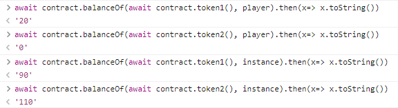
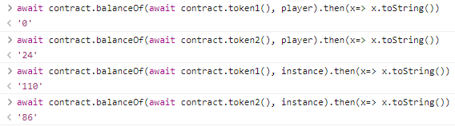
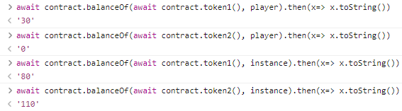
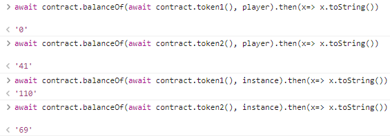
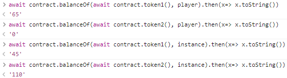
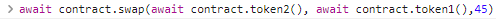

# 👋 1. Dex
__Difficulty 3/10__

- 승리 조건
- 코드 분석
- 풀이
순서로 진행 될 것이다.

- - -

## 승리 조건
- Dex Contract 해킹 후 토큰 중 하나를 모두 소진(0으로 만들기)하는 것이다. 


- - -
## 들어가기 전
이번 문제는 DEX와 ERC20에 대한 지식이 없다면 풀수 없는 문제이다.
Uniswap의 코드를 전부 분석하지는 못하더라도 작동원리에 대해서는 알아야한다.
또한 ERC20 standard에 어떤 function이 필요한지, 어떻게 작동하는지 공부해야한다.
아래 링크들을 통해 충분히 익숙해 진 후 풀기를 권장한다. 링크 이외에 Youtube에도 좋은 자료들이 많다!
- [Uniswap](https://docs.uniswap.org/protocol/V2/introduction)
- [openzeppelin ERC20 contract](https://docs.openzeppelin.com/contracts/4.x/api/token/erc20)

## 코드 분석
분석은 주석에 있습니다!

```solidity
// SPDX-License-Identifier: MIT
pragma solidity ^0.6.0;

//  importing openzeppelin ERC20 contracts and safe math
import "@openzeppelin/contracts/token/ERC20/IERC20.sol";
import "@openzeppelin/contracts/token/ERC20/ERC20.sol";
import '@openzeppelin/contracts/math/SafeMath.sol';

contract Dex  {
    using SafeMath for uint;
    // token 1의 address
    address public token1;
    // token 2의 address
    address public token2;
    
    // token1과 token2의 address를 지정한다.
    constructor(address _token1, address _token2) public {
        token1 = _token1;
        token2 = _token2;
    }

    // 가장 중요한 swap function
    function swap(address from, address to, uint amount) public {
        // token1과 token2이외의 다른 address가 from 또는 to가 되면 revert한다.
        require((from == token1 && to == token2) || (from == token2 && to == token1), "Invalid tokens");
        // 바꾸려는(from) token의 balance가 amount이상 있어야한다.
        require(IERC20(from).balanceOf(msg.sender) >= amount, "Not enough to swap");
        // token a와 token b의 교환 비율을 get_swap_price()를 사용해 계산한다
        uint swap_amount = get_swap_price(from, to, amount);
        // 내 토큰을 Dex contract에 보낸다.
        IERC20(from).transferFrom(msg.sender, address(this), amount);
        // Dex contract가 ERC20 token을 보낼 수 있도록 approve한다.
        IERC20(to).approve(address(this), swap_amount);
        // approve한 만큼의 토큰을 msg.sender에게 보내다.
        IERC20(to).transferFrom(address(this), msg.sender, swap_amount);
    }

    // token1과 token2이외에 liquidity pool을 생성할 수 있다.
    function add_liquidity(address token_address, uint amount) public{
        IERC20(token_address).transferFrom(msg.sender, address(this), amount);
    }

    // swap에서 교환 비율을 계산하기 위해 사용하는 function이다. 
    // 계산 방법은 어번 문제에서 엄청 중요하다!!
    function get_swap_price(address from, address to, uint amount) public view returns(uint){
        return((amount * IERC20(to).balanceOf(address(this)))/IERC20(from).balanceOf(address(this)));
    }

    // spender가 amount만큼의 token에 대해서 approve된다.
    function approve(address spender, uint amount) public {
        SwappableToken(token1).approve(spender, amount);
        SwappableToken(token2).approve(spender, amount);
    }

    // token별 account가 가지고 있는 개수를 확인 할 수 있다.
    function balanceOf(address token, address account) public view returns (uint){
        return IERC20(token).balanceOf(account);
    }
}      

// SwappableToken contract
contract SwappableToken is ERC20 {
    // 계수만큼 minting한다.
    constructor(string memory name, string memory symbol, uint initialSupply) public ERC20(name, symbol) {
        _mint(msg.sender, initialSupply);
    }
}

```
- - -

## 풀이
이번 문제에서 우리는 Dex가 가진 모든 토큰을 소모하면 된다.
그렇다면 어떻게 소모할 수 있을까? 힌트를 보자
- Token의 가격이 어떻게 계산되는가? How is the price of the token calculated?
- Swap이 어떻게 작동하는가? How does the swap method work?
- ERC20의 거래를 어떻게 approve하는가? How do you approve a transaction of an ERC20?

위에서 말 했듯이 ERC20과 Swap의 작동방식을 이해해야 이 문제를 풀 수 있다.
힌트를 토대로 풀어보자.

먼저 문제에서 Swap function이 어떻게 실행되는지 확인해보자
swap은 다음과 같은 과정을 통해 실행된다.
1. from과 to가 token1과 2인지 확인한다.
2. msg.sender의 from token의 잔액(balance)를 확인한다.
3. get_swap_price를 통해 swap할 토큰의 개수를 찾는다
4. swap할 from token을 dex에 보낸다.
5. dex contract 자신이 transferFrom을 사용할 수 있도록 amount만큼을 approve한다.
5. amount만큼의 토큰을 msg.sender에게 보내준다. 

그렇다면 3번에 사용된느 `get_swap_price()`는 어떤 함수일까?
`get_swap_price()`는 예를 들어 token A를 10개를 swap한다고 했을때 token B를 몇개 받을 수 있는지 계산하는 함수이따.
이 함수의 계산 공식은 다음과 같다 `(amount * IERC20(to).balanceOf(address(this)))/IERC20(from).balanceOf(address(this))`

바로 이 공식에 문제가 보인다. 최대금액으로 계속 swap하게되면 내가 가지고 있는 Token의 개수가 늘고 DEX가 가지고 있는 토큰의 개수를 0으로 만들 수 있다.
만약 DEX contract의 토큰 잔액이 0이 되면 언제나 0 또는 error를 return할 것이다.

먼저 swap에서는 transferFrom을 사용하기 때문에 approve를 해주어야한다. 

우리는 DEX contract의 approve를 사용해 token 1과 token 2에 대해 한번에 approve해줄 수 있다.

```js
// contract를 approve 해주기
await contract.approve(instance, "1000000000000000000000")
```
<br/>

이제 swap하기 전 모든 준비가 완료되었다. 이제 swap을 하면서 DEX의 token중 하나의 value를 0으로 만들어보자.

1. 처음으로 내가 가지고 있는 token 2 모두(10)를 token 1로 swap하였다. 

    

2. token 2 20개 모두 token 1로 swap하기

    

swap을 계속하다보면 내가 가지고 있는 token의 개수는 점점 많아지고 DEX가 가지고 있는 Token의 개수는 줄어드는 것을 볼 수 있을 것이다.

3. 3번째 swap

    
4. 4번째 swap

    

5. 5번째 swap

    


마지막 swap은 우리가 가지고 있는 token 65개를 전부 swap하게되면 Dex가 가지고 있는 token의 수보다 많아짐으로 45개만 swap한다. 여기서 45라는 숫자는 `(amount * IERC20(to).balanceOf(address(this)))/IERC20(from).balanceOf(address(this))` 수식에 balance들을 넣어 계산할 수 있다. 

6. 

마지막으로 contract의 token balance를 확인해보면 둘중 하나가 0으로 되어있는 것을 볼 수 있을 것이다.

```js
// 둘 중 하나가 0이면 된다.
await contract.balanceOf(await contract.token1(), instance).then(x => x.toString())
await contract.balanceOf(await contract.token2(), instance).then(x => x.toString())

```

token중 하나의 balance가 0이 된 것을 확인했다면 ethernaut으로 돌아와 Submit instance를 누르고 조금 기다리면 block이 mine되고, 아래와 같이 뜨며 마무리된다.
```
٩(- ̮̮̃-̃)۶ Well done, You have completed this level!!!
```
- - -

## 마무리
이번 문제와 같은 경우는 자본이 많다면 쉽게 가격을 조작할 수 있게된다. 그렇기 떄문에 대부분 oracle을 사용해 정보를 얻어온다. 나는 Chainlink Oracle에 대한 개념은 있지만 직접 사용해본 적이 없다. 문제를 풀면 kovan testnet에서 사용할 수 있는 코드를 주는데, 이는 oracle을 직접적으로 사용해보는 코드이다. 나중에 contract를 짤때 그리고 uniswap을 분석할 떄를 대비해 미리 공부해두면 좋을 것 같다. 

이번 문제를 풀기전 Uniswap V2 코드를 분석해봤는데, 아직 내가 부족하구나ㅠㅠ 라는 것을 느낄 수 있었다. Ethernaut가 끝난 후 여러가지 여러 종류의 contract를 분석하며 기술을 꾸준히 연마해가야겠다!

- - -
## REF
- rinkeyb network ether faucet: https://faucets.chain.link/rinkeby
- ethernaut: https://ethernaut.openzeppelin.com/
- remix IDE: https://remix.ethereum.org
- Ethernaut 22 DEX walkthrough: https://medium.com/@this_post/ethernaut-22-dex-modified-version-writeups-4330c33a0743

```toc

```