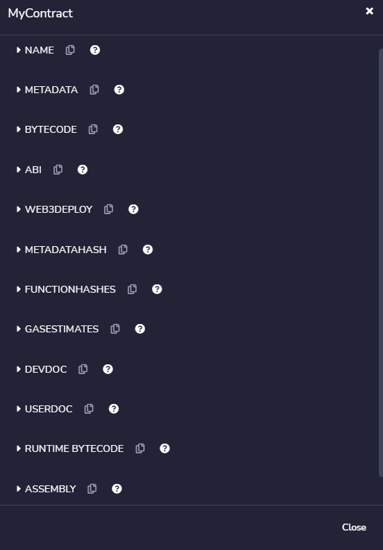

# 👋 Solidity Bytecode and Opcode Basics
이 글은 내가 공부하면서 찾은 [이 글](https://medium.com/@blockchain101/solidity-bytecode-and-opcode-basics-672e9b1a88c2)을 변역하였다. 이 글은 ethernaut의 magicnumber의 저자가 작성한 글이며 bytecode와 opcode의 기본기에 대해서 다룬다. 나는 ethernaut 문제풀면서 이 개념에 접근하게 되었으며 공부하게 되었다. 글에는 내가 생각하는 부분이 포함되어있을 수도 있기 때문에, 내 글이 이해가 잘 되지 않는다면 [원문](https://medium.com/@blockchain101/solidity-bytecode-and-opcode-basics-672e9b1a88c2)을 읽어보는 것을 추천한다. 이미지 같은 경우 내가 공부하면서 얻은 최신이미지로 대체하였다. 

### 시작
smart contract에 대해서 깊게 공부하면 할 수록 `PUSH1`, `SSTORE`, `CALLVALUE` 등과 같은 용어를 사용하게 될 것이다. 이러한 용어들은 무엇이고 우리는 그 용어들에 대해 알아야할까?


이러한 용어를 알기 위해서는 이더리움 가상 머신(EVM)에 더 깊이 배워야 한다. 나는 이 주제에 대해 구글에 검색해 보았지만 관련 자료가 너무 적어 놀랐다. 아마 너 기술적 이어서일까? 그래서 이 글에서는 EVM 기초를 최대한 간단하게 설명해 보려고 한다.

다른 유명한 프로그래밍 언어들(C, JAVA)과 마찬가지로 Solidity도 고급 프로그래밍 언어이다. 우리는 고급 프로그래밍 언어를 이해하고 작성하지만, 기계는 고급 프로그래밍언어를 이해하지 못한다. 그래서 solidity compiler를 사용해 EVM(기계)이 이해할 수 있는 언어로 변환시킨다. 이때 기계가 이해할 수 있는 언어는 Bytecode이다.

<!-- 우리가 Geth와 같은 이더리움 클라이언트를 설치하면 스마트 컨트랙트를 실행하기 위해 특별히 만들어진 경량 운영체제인 이더리움 버추얼 머신도 함께 나온다. -->

매우 간단한 contract를 예로 들어 보겠다.

```solidity
pragma solidity ^0.8.11;

contract MyContract {
    uint i = (10 + 2) * 2;
}
```

[Remix IDE](https://remix.ethereum.org)에서 이 코드를 실행하고 contract 내용을 클릭하면 많은 정보를 볼 수 있다.



이 경우 컴파일된 코드는 다음과 같습니다.(RunTime Cdoe)

```
6080604052600080fdfea26469706673582212208d96441222a360f13b82dab7729b766da71f9e974dfc161fad4d0f49fc65b64664736f6c634300080b0033
```

이 긴 값들은 바이트코드라고도 알려진 최종 계약의 16진수 표현이다. 리믹스 브라우저의 "Web3 Deploy" 섹션에는 다음과 같이 나와있다.

```javascript
var mycontractContract = new web3.eth.Contract([]);
var mycontract = mycontractContract.deploy({
     data: '0x60806040526018600055348015601457600080fd5b50603f8060226000396000f3fe6080604052600080fdfea26469706673582212208d96441222a360f13b82dab7729b766da71f9e974dfc161fad4d0f49fc65b64664736f6c634300080b0033', 
     arguments: [
     ]
}).send({
     from: web3.eth.accounts[0], 
     gas: '4700000'
   }, function (e, contract){
    console.log(e, contract);
    if (typeof contract.address !== 'undefined') {
         console.log('Contract mined! address: ' + contract.address + ' transactionHash: ' + contract.transactionHash);
    }
 })
```


간단히 말해 계약을 구축할 때 권장 가스가 4700,000인 16진수를 데이터 필드 아래에 배치하기만 하면 됩니다.
EVM과 대화하려면 16진법을 생각해봐야한다. 왜 여러분의 지갑이나 transaction address 앞에 "0x"가 있는지 궁금해 본 적이 있지 않은가? 맞다, "0x"로 시작하는 것은 단순히 값이 16진수라는 것을 나타낸다. 16진수 앞에 "0x"를 두는 것은 필수는 아니다. 왜냐하면 EVM은 어떤 값이라도 16진수로 취급하기 때문이다.

또한 opcode가 표시된다.

```
PUSH1 0x80 PUSH1 0x40 MSTORE PUSH1 0x0 DUP1 REVERT INVALID LOG2 PUSH5 0x6970667358 0x22 SLT KECCAK256 DUP14 SWAP7 DIFFICULTY SLT 0x22 LOG3 PUSH1 0xF1 EXTCODESIZE DUP3 0xDA 0xB7 PUSH19 0x9B766DA71F9E974DFC161FAD4D0F49FC65B646 PUSH5 0x736F6C6343 STOP ADDMOD SIGNEXTEND STOP CALLER 
```

opcode는 사람이 읽을 수 있는 low level instruction(명령어)이다. 모든 opcode는 16진수로 되어있다. 예를 들어 `MSTORE`는 `0x52`, `SSTORE`은 `0x55` 등이다. 예전 [Ethereum Yellow Paper](http://gavwood.com/paper.pdf)(이더리움 기술 정의서)에 모든 solidity opcode와 16진수 값에 대해 나와있으니 확인해 보는 것을 추천한다.

EVM은 Stack기반의 Machine이다. 간단히 설명하자면 프링글스 통에 프링글스 과자를 넣는다고 생각해보자. 마지막으로 넣은 과자 조각이 우리가 첫번째로 꺼내는 조각이 될 것이다. 우리는 컴퓨터 공학적인 용어로 LIFO(First In Last Out)라고 부른다.

일반 산술에서, 우리는 수식을 다음과 같이 쓴다.
```
// Answer is 14. we do multiplication before addition.
10 + 2 * 2
```

stack 기반의 machine에서는 LIFO 원리로 작동한다.
```
2 2 * 10 + 
```

이것은 `2`를 먼저 스택에 넣고, 그 다음에 또 다른 `2`를 넣고, 그 다음에 곱셈을 수행하라는 것을 의미한다. 결과는 스택 위에 `4`가 놓입니다. 이제 `4` 위에 숫자 `10`을 더하고 결국 두 숫자를 더한다. 스택의 최종 값은 `14`가 됩니다. 이러한 유형의 산술은 Postfix Notation 또는 [Reverse Polish Notation](https://en.wikipedia.org/wiki/Reverse_Polish_notation).

필자는 다행히 컴퓨터 공학 수업에서 배운 것이 기억나 쉽게 이해할 수 있었다. 어려운 개념은 아니기 때문에, 잘 모르겠다면 postfix notation에 관한 youtube 영상을 몇개 보고와도 잘 이해할 수 있을 것이다.

스택에 데이터를 넣는 행위를 PUSH 명령어라고 하며 스택에서 데이터를 제거하는 행위를 POP 명령어라고 한다. 위의 예에서 볼 수 있는 가장 일반적인 opcode는 스택에 1바이트의 데이터를 넣는 것을 의미하는 "PUSH1"입니다.

명령어는 다음과 같이 쓰인다.
```
PUSH1 0x80
```
스택에 "0x80"의 1바이트 값을 넣는 것을 의미한다. 공교롭게도 "PUSH1"의 16진수 값도 "0x60"이 된다. 의무적 표기가 아닌 "0x"를 제거하면, 바이트코드로 이 논리를 "6080"으로 쓸 수 있다.

조금 더 살펴보자
```
PUSH1 0x80 PUSH1 0x40 MSTORE
```

우선 MSTORE(0x52)는 2개의 Input을 받고 Output을 내지 않는다. 위의 opcode는 다음을 의미한다.

1. PUSH1(0x60): 0x80을 스택에 넣습니다.
2. PUSH1(0x40): 0x40을 스택에 넣습니다.
3. MSTORE(0x52): 0x60 메모리 공간을 할당하고 0x40 위치로 이동합니다.


그 결과 바이트코드는 다음과 같다.
```
6080604052
```

사실 우리는 `6080604052`와 같은 마법같은 숫자를 어느 solidity bytecode에서든 볼수 있다. 필자가 실제로 ethernaut에 사용했던 code들을 전부 확인해 보니 모두 `6080604052`로 시작했다.~~신기방기~~

좀 더 복잡하게 만들어보자면 `0x40` 이나 `0x80`은 우리가 평상시 사용하는 40 또는 60으로 해석할 수 없다. 위에허 말했듯이 이는 16진수를 사용하고 있기 때문이다. `0x40`은 64, `0x60`은 96과 같다.

간단히 말해서, "PUSH1 0x80 PUSH1 0x40 MSTORE"는 96바이트의 메모리를 할당하고 64바이트의 시작 부분으로 포인터를 이동하는 것이다. 현재 스크래치 공간은 64바이트, 임시 메모리 저장 공간은 32바이트입니다.
~~필자는 이 부분이 잘 이해가 안된다ㅠㅠ 관련해서 공부한 글 더 쓸 예정!~~

EVM에는 데이터를 저장하는 3개의 장소가 있다. 첫번째로 stack이다. 위의 예와 같이 "PUSH" opcode를 사용하여 데이터를 저장한다. 두 번째로, 메모리(RAM)에서는 "MSTORE" opcode를 사용하고, 마지막으로 storage에 "SSTORE"를 사용하여 데이터를 저장한다. 데이터를 storage에 저장하는데 필요한 가스가 가장 비싸고 stack을 이용하는 것이 가장 저렴하다.

### Assembly Language

opcode를 이용해 전체 smart contract를 작성하는 것도 가능하다. 바로 여기서 'Solidity Assembly Language'가 필요합니다. 이해하기 어렵겠지만 가스를 절약하고 solidity만으로 할 수 없는 일을 하고 싶다면 유용할 수 있습니다.


### Summary
우리는 bytecode의 기본과 몇 개의 opcode만 다루었다. 아직 이야기되지 않은 않은 opcode가 너무 많지만, 우리는 적어도 전체적인 컨셉에 대해서 파악할 수 있었다고 생각한다. 우리가 심지어 solidity opcode를 배우는 데 신경써야 하는지에 대한 원래 질문을 거슬러 올라가면- 아마도 그렇다, 아니다.

smart contract를 작성하기 위해 opcode를 알 필요가 없다. 반면에, EVM 오류 처리는 여전히 매우 원시적이며 Error가 일어났을 때 opcode를 살펴보는게 편리하다. 그렇기 때문에 더 배우는 것이 나쁠 것은 없다고 생각한다.

<!-- 
## a

a.sol -> a.abi, a.bin(bytecode) ->
bytecode translated to opcode
yellow paper안에 opcode들이 써있는 ex) push, pop, mstore 등등

initialize할때 initial code 와 runtime code로 나누어짐, initial code는 constructor등을 가지고 있음, runtime code에는 function 및 state들이 들어가 있음

EVM은 stack기반이다. 

 -->

```toc

```