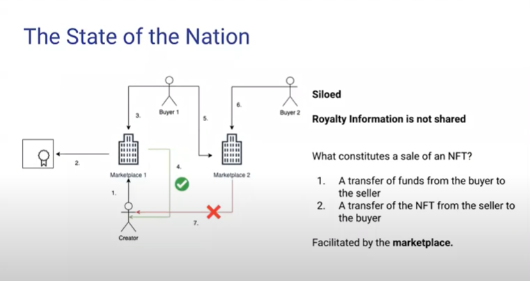

# 👋 EIP-2981에 대하여 (Royalty Standard) -> 재판매 수수료

## 무엇이며 왜 등장하였나?
EIP-2981은 NFT(Non-Furgable Token)에 대한 Royalty(재판매 수수료) 지급 정보를 저장해두는 표준이다. 

현재 NFT의 Royalty 좀 이상하다. 진짜 말 그대로 이상하다.


<br>
위 사진을 보면 알 수 있다시피, marketplace마다 royalty 지급 기준이 다르다. 그러면 다음과 같은 문제가 일어날 수 있다.

예를 들에 OpenSea에서 A가 작품을 민팅하여 판다고 가정해보자. 그리고 10%의 royalty를 적용했다고 생각해보자.
1. A는 Opensea를 사용해 B에게 작품 판매를 통해 돈을 벌었다.
2. B는 Opensea에서 다시 작품을 C 판매해 수익의 90%를 챙긴고, 10%는 A에게 돌아간다.
3. C는 Opensea가 아닌 Rarible에가서 작품을 재판매 했다.
4. C는 돈을 받지만 A는 작품에 대한 Royalty를 받지 못한다.

현재 대부분의 marketplace는 Royalty에 대해서 호환되지 않는다.
이 부분을 보안하기 위해서 EIP-2981이 등장하게 되었다. 

<br>
<br>

## 저장수장이라고? 
그렇다 EIP-2981은 Royalty의 정보를 저장해 놓는 방법을 말한다. 

그렇다면 왜 MarketPlace는 왜 royalty standard를 사용할까?
- Royalty Standard를 사용하게 된다면 플랫폼간의 호환성이 생긴다. 이는 원작자를 보호할 수 있는 하나의 수단이 되며, 더 많은 사용자를 끌어들일 수 있을 것이다.

<br>
<br>

## Opensea는 어떻게 하고 있는가?
현재는 각자의 플랫폼 마다 royalty를 적용하는 방법이 다르다. Opensea와 같은 경우는 smart contract에 contractURI를 정의해놓는 것으로 json파일의 링크를 넣는다. 그리고 json 파일은 collection의 이름, 설명, 메인 이미지, Royalty Info 등을 가진다.

<br>
<br>

## Marketplace는 지금 royalty standard를 적용하였나?
테스트를 진행해본 결과 아직 적용이 되지는 않았다. 하지마 몇달 내에 적용 될 것으로 보인다

---


```toc

```