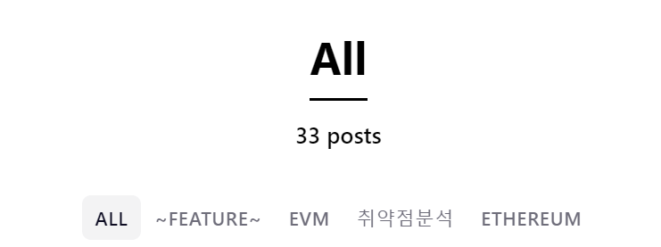

# 👋 30개의 글을 쓰면서 느낀점


블로그를 시작한지 약 한달 반이 지났다. 초보 블로거로서 약 30개 정도의 블로그 글을 적으며 글쓴이로써 부족한 점을 많이 느낀다. 그래서 글을 적으며 배운점 및 느낀점을 적어내려가보려고 한다.  


이 블로그의 최초 목적은 기술 블로그였다. 내가 배우고 있는 기술에 대해 기록하는 것이 목적인. 그렇기에 내가 공부한 것을 토대로 글을 쓴다. 글을 쓰다 문득 느끼는 점은 나는 무엇을 위해 글을 쓰는가였다. 생각해보면 나는 아래 두가지 목적을 위해 글을 쓰기 시작하는 것 같다.

1. 나의 발전을 위하여
2. 남의 발전을 위하여

#### 1번 나의 발전을 위하여.
나는 공부를 하면서 내가 공부했던 것들을 돌아볼때가 많다. 문제들을 해결해가다보면 겹치는 부분이 있고, 내가 공부했던 내용을 보면 이해가 더 잘된다. 기록은 나의 발전에 있어서 큰 기어를 하고 있다고 느낀다. 

아직 한달밖에 지나지 않았기에 정말 많은 발전이 있었다고는 말하지 못하겠다. 하지만 일년이 지난다면 다른 기술 블로거들이 말했던 것처럼 분명히 내 발전에 큰 도움이 되었다고 자신있게 말할 수 있을 것이라고 굳게 믿는다.

#### 2번 남의 발전을 위하여
남의 발전을 위하여. 다른 사람들이 내 글을 읽고 도움이 되면 좋겠다라는 생각을 종종했다. 다른 개발 분야(Frontend, Backend등)는 정보를 구하기 너무 쉽다. 인강도 많을 뿐더러 깊게 다루기 때문에 노력만한다면 초심자가 발을 들이기 쉬울 것 같다라는 생각을 했다. 

하지만 블록체인, EVM, Smart Contract과 같은 경우에는 다른 개발 분야에 비해 한국어로 되어있는 자료가 많지 않다. 물론 예전에 비해 한국어로 된 자료는 훨씬 많아졌지만, 더 깊은 이해를 위해서는 영어 유투브와 영어로된 자료들을 찾아보게 된다. 나는 미국에서 5년정도 살다왔기 때문에 큰 문제는 없지만, 영어를 힘들어하는 사람에게는 이보다 높은 진입장벽이 없다. 그렇기에 나의 글이 그들의 발전에 기여할 수 있을 것이라는 생각이 들었다. 


#### 기록자로써의 장점과 단점
기록자로써 현재 나의 장점은 많은 글을 올리는 것이다. 최대한 공부한 내용을 다 전달하려고 노력한다. 하지만 나는 아직까지 나만을 위한 글을 쓰고있다는 생각이 든다. 다른 사람들이 잘 알아볼 수 있을까? 생각했을때 아직은 아닌 것 같다ㅠㅠ 하루 공부한 내용을 매일 기록하려다보니 내가 지치고 질이 떨어진 것 같다. 

어떻게 좋은 글을 빠르게 쓸 수 있을까? 앞으로 글을 쓸때 꼭 생각해야하는 부분이다. 사람들은 좋은 글을 찾는다. 그렇기에 위 2가지 목적을 이루기 위해서는 좋은 글을 많이 읽는 것과 좋은 글쓰는 것을 연습하는 방법밖에 없다. 

#### 마무리
나 자신 앞으로도 화이팅ㅎ


```toc

```