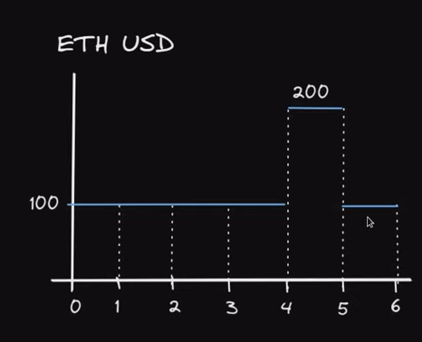
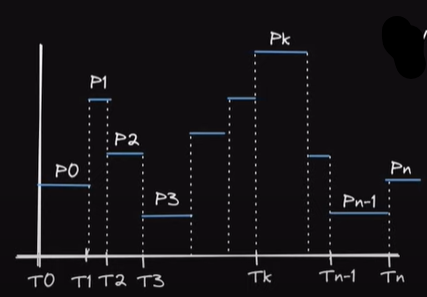
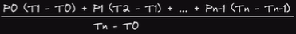
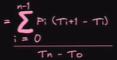
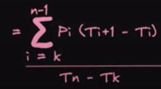
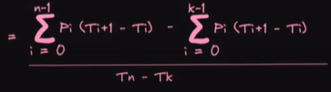

# 👋 TWAP - Time Weighted Average Price
수학에 재능이 없는 나
Defi에 들어가 있는 수식에 대한 이해를 더하기 위해 TWAP에 대해서 배우게 되었다.


## Twap이란
TWAP(Time Weighted Average Price)이란 본래 미국 주식 매수 주문 종류중 하나로 시간을 동일하게 나누어 동일한 수량을 기계적으로 주문하는 방법이다. 즉 지정된 시간동안의 평균 가격인 것이다. 

주식에서와 다르게 uniswap은 On-Chain Oracle을 제공하기 위해 Twap을 사용하였다. 이번 글에서는 Twap에 대해서 알아보도록 할 것이고, UniswapV2가 이를 어떻게 사용하고 있는지 알아볼 것이다.

## TWAP 예시 1



위 사진을 예로 들어보겠다. 이 사진의 Average Price는 어떻게 구할까?
수식으로 나타내면 `TWAP = (100*4/6) + (200*1/6) + (100*1/6)` 일 것이고 `TWAP = 700/6 = 116.666...`으로 나타낼 수 있다. 

조금 더 복잡한 예시를 통해 수식을 만들어보자

## TWAP 예시 2


우리는 T0에서 Tn까지의 TWAP을 구하기 위해서는 다음과 같은 수식을 만들 수 있다. 


이 수식을 Sigma를 사용해 표현한다면 다음과 같은 수식을 얻을 수 있다.



만약 T0부터 Tn까지가 아닌 Tk부터 Tn까지의 TWAP을 구하고 싶다면 다음과 같은 수식으로 변경하면 된다. 



마지막으로 위 수식은 아래 수식으로 구할 수도 있다.


## 추가 의견
오늘 다뤘던 TWAP은 Uniswap Pair Contract에서 다뤘던 Price{0,1}Cumulative에 적용된다. 그리고 이를 사용해 Oracle을 제공한다.

## 마치며
Defi의 중심인 수학 수식을 다뤄봤다. 아직까진 전체적인 구조에 대해 완력하게 이해하지는 못했지만, UniswapV2를 끝까지 분석해본다면 보다 완벽한 이해를 할 수 있을 것으로 보인다.

### Ref
- https://www.youtube.com/watch?v=FNpkUNHHn7c
- https://docs.uniswap.org/protocol/V2/concepts/core-concepts/oracles

```toc

```