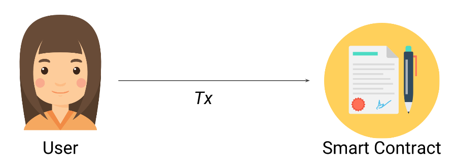
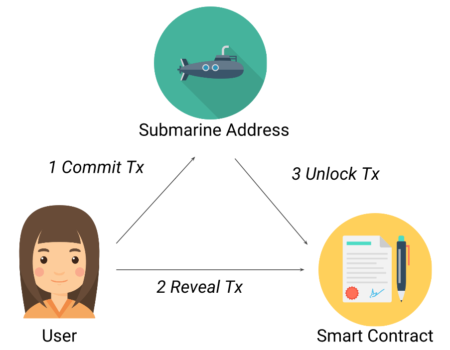

# 👋 Front Running
## Front Running이란?
transaction이 포함된 block이 생성되기까지 약간의 시간이 소요된다. 네트워크 참여자들(miners & full nodes)은 처리되기 전의 transcation을 볼 수 있다. 만약 네트워크 참여자가 악의적인 마음을 품는다면 이후에 일어날 transcation을 알 수 있고 이에 대한 정보를 악의적으로 사용할 수 있다. 

즉 front running은 block이 채굴되기 전 transcation을 확인해 자신이 더 높은 값의 gas price를 지불하여 이득을 취하는 것이다. 

예시를 본다면 더 이해가 잘 될 것이다.

- - -

## Example Code
```solidity
contract FindThisHash {
    bytes32 public constant hash =
        0x564ccaf7594d66b1eaaea24fe01f0585bf52ee70852af4eac0cc4b04711cd0e2; // hash of "Ethereum"

    constructor() payable {}

    function solve(string memory solution) public {
        require(hash == keccak256(abi.encodePacked(solution)), "Incorrect answer");

        (bool sent, ) = msg.sender.call{value: 10 ether}("");
        require(sent, "Failed to send Ether");
    }
}
```
이 코드는 간단한 추측 게임 코드이다. 
hash 값의 변환 전 단어 맞출시 10 ether를 contract에 있는 10 ether를 가져갈 수 있다.

시나리오는 이렇다.
1. A가 FindThisHash contract를 10 ether를 포함해 배포한다.
2. B가 hash의 변환 전 단어를 찾는다.("Ethereum")
3. B는 찾은 답을 매개변수로 하여 solve function을 call한다. Call 할때 gas price 15 gwei로 지정한다.
4. C는 transcation pool 보고있다가 누군가 FindThisHash contract의 문제를 풀었고 solve function을 콜한 것을 볼 수있다.
5. C는 얻는 정보를 토대로 같은 답을 써서 transaction을 보낸다. 이때 B가 보낸 gas price보다 높은 100gwei를 지불한다.
6. C의 transaction이 먼저 채굴되고 C가 보상을 획득하게 된다.

위에 시나리오처럼 transaction data를 미리 알면 악의적으로 이득을 취할 수 있다.

- - -

## Real World Example (Synthetix)
Synthetix는 탈중앙화 거래소 중 하나이다. Synthetix는 다른 탈중앙화 거래소와 다르게 독득한 특징을 가지고 있다. Order book을 통해서 거래되는 것이 아닌 Exchange Rates에 의존해서 모든 매수/매도를 통해 가격이 결정된다.
만약 trader가 Exchange Rate가 업데이트 되기 전에 곧 업데이트 될 값을 알 수 있다면 어떻게 될까?
바뀔 Exchange Rate을 안다는 것은 매수가/매도가를 미리 알 수 있다는 말과 같다. 바뀔 매수가/매도가를 미리 알면 상승할 토큰을 미리 사두어 수익을 실현 할 수 있다. 마찬가지로 하락할 토큰을 미리 팔아 손해를 최소화 할 수 있게된다.

위에서 보았던 Example Code의 시나리오처럼 Synthetix에서도 자금 탈취가 일어났었다. 한 사용자가 Trading bot을 구축해 Exchange Rate을 미리보고 이득을 취하고 있었다.


## How to prevent?
1. submarine send
submarine send을 사용하면 채굴자 또는 네트워크 참여자가 transaction을 미리 볼 수 없게 된다. 관련 없는 transaction과 섞여있다가 나중에 상호작용 있던 smart contract 다시 상호작용 할 수 있게 된다. 이는 이미 악의적인 사용자가 front running하기 늦은 상황이 됨으로 attack을 방어할 수 있다. 

기존의 transaction은 밑에 사진처럼 user와 smart contract이 직접 상호작용 할 수  있다.

submarine send를 이용하면 commit-reveal scheme을 활용하여 transaction을 감추 수 있다(정보를 감추기 위해 private & public key를 사용한다).


- - -

## 마무리
smart contract 자체에서 문제보다 블록체인이 가진 특성을 이용하는 공격이다. 이를 좀 더 자세히 이해하기 위해서는 블록체인 자체에 대한 공부가 더 필요할 것이라고 생각한다. smart contract와 더불어 블록체인 코어에도 익숙해져보자! 
- - -

### Reference
- https://solidity-by-example.org/hacks/front-running/
- <span style="color:grey"> https://medium.com/haechi-audit-kr/synthetix-front-running-explained-c0d638982cb1 </span>  
- https://libsubmarine.org/
- - -


```toc

```