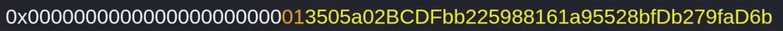

# 👋 Private

## 들어가기전
### 여기서 말하는 Private이란 무엇인가?
여기서 말하는 private은 __private variable__ 을 말한다. 즉 variable의 visability가 private이라는 뜻이다. 예시로 ```bool private isTrue``` ```uint256 private count``` 등이 될 수 있다. 


### 왜 문제가 되는가?
private은 smart contract 범위에 대해서만 비공개이다. 즉 다른 smart contract에서 엑세스하거나 수정할 수 없다. 하지만 이더리움 블록체인상의 데이터는 누구나 읽을 수 있음으로 정말 private한 데이터는 저장해서는 안된다.
private variable 취약점에 관한 글은 [여기서](https://holyhansss.github.io/vulnerability/private_variable/private_variable/) 볼 수 있다.

### private 예제를 이해하기 위해 알아야 하는 것
smart contract의 storage: 
1. 각 smart contract는 2^256 slots를 가진다.
2. slot은 각각 32 bytes를 저장할 수 있다
3. 데이터는 선언 순서에 따라 앞에서부터 순차적으로 저장된다.
4. 공간 절약을 위해 최적화된다. 
    - 하나 이상의 data가 slot에 들어갈 수 있다.
    - slot에 우측에서부터 저장된다. 
    ex) 
    
    예시에서 노란색은 address, 주황색은 bool 값이다. 우측에서 저장된다는 말에서 알 수 있듯이 address가 먼저 선언되고 이후에 bool이 선언되었다.


보다 잘 이해하기 위해 Example Code를 살펴보자!!
- - -

## Example code
간단한 code로 이해해보자!
```solidity
contract StorageTest {
    uint256 public a;
    uint256 private b;

    function doSomething() public {
        // Do Something
    }

```
example code를 보면 code는 변수 a는 public, 변수 b는 private으로 저장되어 있다. 하지만 위에서 말했듯이 모든 state variable은 확인이 가능하다.

## 실습
실습을 위해서는 truffle console이 필요하다. 아마 취약점에 대해 공부하고 있는 중이라면 이미 smart contract를 작성해보고 배포도 해보았을 것이라고 생각한다. 그렇기 때문에 truffle을 사용할 줄 안다고 가정하겠다.

실습을 위해서 ropsten test network에 접속하자! 우리는 누군가 이미 배포해 놓은 contract를 사용하여 variable을 확인해 볼 것이다.

실습에 사용된 Full Code는 Reference에 달아놓았으니 전체적인 코드를 보면서 해도 좋을 것 같다.
```
truffle console --network ropsten
addr = "0x3505a02BCDFbb225988161a95528bfDb279faD6b"

// private으로 저장된 password variable이 slot 2에 저장되어 있다.
// 아래 명령어를 실행시키면 32 bytes의 value가 하나 나올 것이다.
web3.eth.getStorageAt(addr, 2, console.log)

// 위에서 나온 32 bytes 값을 적용하여 다음의 명령어를 실행시킨다.
web3.utils.toAscii("위에서 나온 값")

// 우리는 private으로 저장된 password를 찾을 수 있다!!
```

- - -

## How to prevent?
블록체인 상의 모든 데이터는 모두에게 공개됨으로 민감한 정보는 절대 smart contract에 포함하지 말자!!

- - -

## 마무리
private과 같은 취약점들은 EVM에 대해서 좀 더 깊이 알수록 이해하기 쉽다고 생각한다. private을 공부하면서 compile 할때 정보들이 어느 순서로, 어느정도의 공간을 storage에서 차지하는지에 대해 알아볼 수 있어서 좋았다!! 기다려라 EVM!!!ㅋㅋㅋ


- - -

### Reference
- 실습 코드: https://solidity-by-example.org/hacks/accessing-private-data/

```toc

```