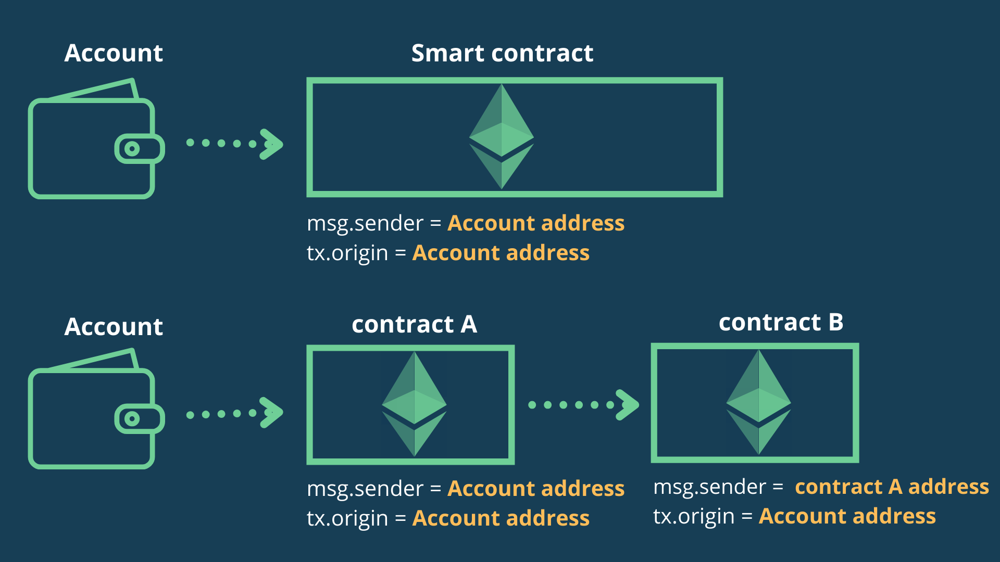

# 👋 tx.origin

## txorigin vs msg.sender
주로 tx.origin은 msg.sender과 비교된다.   
우선 우리가 잘 아는 msg.sender는 함수를 호출한 사람을 가리키는 주소이다.
tx.origin을 보면 tx는 transaction을 뜻한다. 즉 transaction을 만든 address를 뜻한다.

만약 account에서 smart contract A로 transaction을 보낸다면 msg.sender와 tx.origin은 같을 것이다. 왜냐하면 transaction을 만든이와 transaction을 보낸 사람이 같기 때문이다.

그렇다면 account -> smart contract A -> smart contract B 순으로 transaction을 보낸다면 어떻게 될까? B의 관점에서 본다면 transaction을 만든이는 account이고 msg.sender은 A일 것이다.
밑에 사진을 본다면 이해가 더 쉬울 것이다. 


- - -

## Example Code
이 Example Code는 solidity docs에 나와있는 내용이다!
```solidity
// SPDX-License-Identifier: GPL-3.0
pragma solidity >=0.7.0 <0.9.0;
// THIS CONTRACT CONTAINS A BUG - DO NOT USE
contract TxUserWallet {
    address owner;

    constructor() {
        owner = msg.sender;
    }

    function transferTo(address payable dest, uint amount) public {
        // THE BUG IS RIGHT HERE, you must use msg.sender instead of tx.origin
        require(tx.origin == owner);
        dest.transfer(amount);
    }
}
```
```
contract Wallet {
    address public owner;

    constructor() payable {
        owner = msg.sender;
    }

    function transfer(address payable _to, uint _amount) public {
        require(tx.origin == owner, "Not owner");

        (bool sent, ) = _to.call{value: _amount}("");
        require(sent, "Failed to send Ether");
    }
}

contract Attack {
    address payable public owner;
    Wallet wallet;

    constructor(Wallet _wallet) {
        wallet = Wallet(_wallet);
        owner = payable(msg.sender);
    }

    function attack() public {
        wallet.transfer(owner, address(wallet).balance);
    }
}
```
시나리오는 이렇다.
1. A가 10 Ether와 함께 Wallet contract를 배포한다.
2. B가 Attack contract를 Wallet contract의 주소와 함꼐 배포한다.
3. A가 Attack contract의 attack()을 call한다.
4. B는 Alice의 Ether를 다 가져오게 된다. 

"누가 속아서 attack()을 call해!" 할 수 있지만 충분히 일어날 수 있다고 생각된다.
- - -

## How to prevent?
solidity docs에서도 tx.origin을 authorization 사용하지 않을 것을 권장하고 있다. 또한 tx.origin은 사라질 수도 있다고 한다! 그러니 앞으로 msg.sender를 사용하도록 하자

```
Besides the issue with authorization, there is a chance that tx.origin will be removed from the Ethereum protocol in the future, so code that uses tx.origin won't be compatible with future releases Vitalik: 'Do NOT assume that tx.origin will continue to be usable or meaningful.'
```
- - -

## 마무리
정말 간단하게 고칠 수 있는 부분이라고 생각이 든다. 그리고 동시에 이런 사소한 실 수 하나가 큰 영향을 미칠 수 있다는 것이 놀랍다. 앞으로 tx.origin 말고 msg.sender를 꼭 사용하자!!!


### Reference
- https://davidkathoh.medium.com/tx-origin-vs-msg-sender-93db7f234cb9
- https://solidity-by-example.org/hacks/phishing-with-tx-origin/
- https://docs.soliditylang.org/en/v0.8.10/security-considerations.html
```toc

```