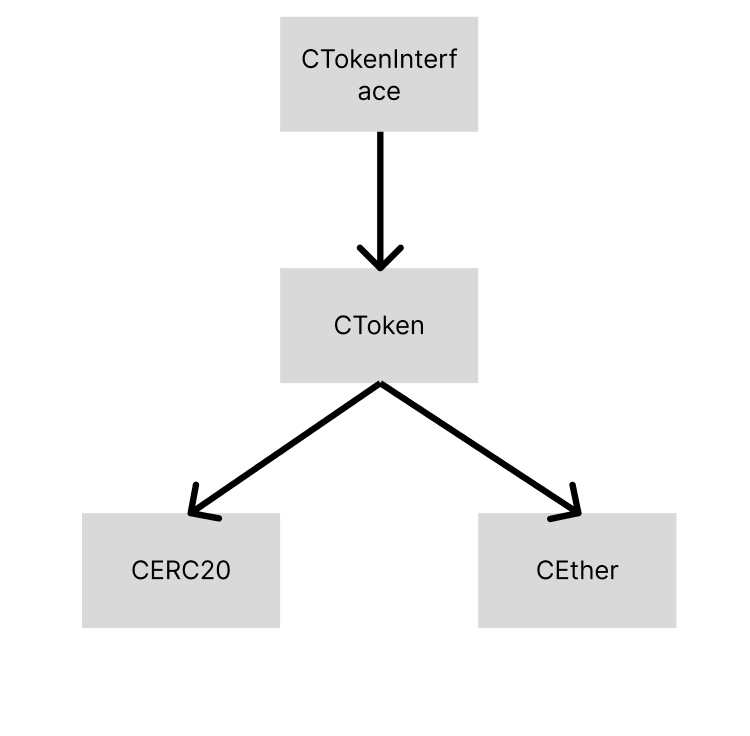

# 👋 Compound

## Compound란
Compound Protocol은 이더리움 smart contract으로 구현된 탈중앙 대출 서비스이다. 전통 금융에는 2가지 대출이 존재한다. 바로 신용대출과 담보대출이다. Compound는 담보대출을 smart contract로 구현하였다. 신용대출 같은 경우는 블록체인 상에서 구현하기 어렵다. 블록체인에서 모든 거래는 공개키와 비공개키를 기반으로 이루어지기 때문에, 누가 누구인지 식별하여 신용을 평가하기 어렵다. 하지만 담보는 신용과 다르게 평가 기준이 명확하다. ~~돈만 가지고 있으면 된다!~~

Compound는 ERC20 기반의 토큰을 담보로 받고 다른 토큰을 대출해준다. Compound에는 5가지 주요 기능이 존재한다. 

- 공급(mint)
- 출금(redeem)
- 차용(borrow)
- 상환(repay)
- 청산(liquidate)

위 5가지 기능은 compound에서 가장 중요한 기능이며, `CToken.sol` 에 정의되어있다. Compound 시리즈에서는 CToken을 중심으로 연관된 contracts들을 분석해볼 예정이다. 


## 간단한 코드 구조


Compound의 주요 contracts는 CERC20, CEther, CToken이다. CERC20와 CEther는 CToken를 상속하고 있다. 유저와 contract의 상호작용은 모두 CERC20 이나 CEther를 통해 이루어진다. 


### Ref
- https://docs.olympusdao.finance/main/
- https://blockchainlaboratory.tistory.com/49
- https://talken.io/board/post/TOKEN_TALK/311393

```toc

```